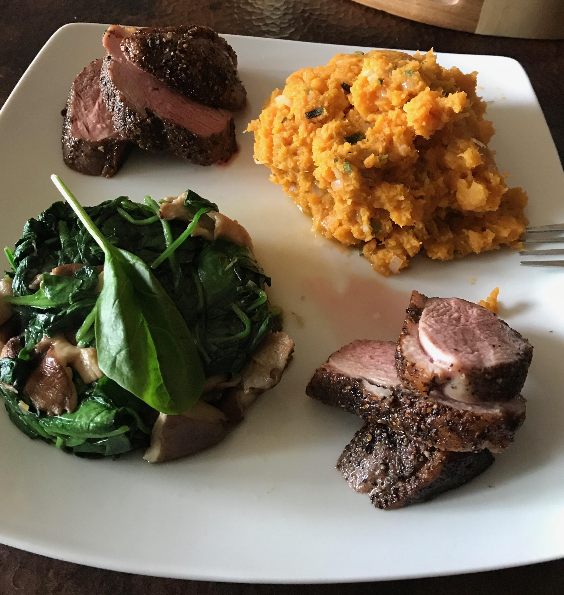

```{r 01-setup, include=FALSE}
# Set global R options
options(htmltools.dir.version = FALSE, servr.daemon = TRUE)

# Set global knitr chunk options
knitr::opts_chunk$set(
  dev = "svg",
  fig.align = "center",
  cache = TRUE,
  error = FALSE,
  message = FALSE, 
  warning = FALSE, 
  collapse = TRUE 
)
```

class: center, middle, inverse

background-image: url(https://i.pinimg.com/originals/e5/26/c1/e526c1b66d356fe88886c1803be31255.png)

# Introductions

---

## Who Are These Guys?

<br>
```{r 01-two-guys, echo=FALSE, out.width="50%", fig.align='center'}

```

---

## Who Are These Guys?

.pull-left[

.large[**Brad Boehmke**] 

* 84.51°

* UC, WFU, AFIT

* Dayton, OH

* Married with 2 little girls

* [bradleyboehmke.github.io](http://bradleyboehmke.github.io/)

]

--

.pull-right[

.large[**Brandon Greenwell:**] 

* Statistician turned data scientist

* Also at 84.51° (just moved to Cinci from Dayton)

* WSU, UC

* [My R packages](https://github.com/bgreenwell)
  
```{r, echo=FALSE, out.width="40%"}

```

]


---

class: center, middle, inverse

background-image: url(Images/intentions.jpg)
background-position: center
background-size: contain

# Intent of the Course


---

## Agenda

.pull-left[

.large[__Day 1__:]

* ML Fundamentals

* Regularization

* Multivariate Adaptive Regression Splines (MARS)

* Feed-forward Neural Networks

* Kaggle!

]

.pull-right[

.large[__Day 2__:]

* Naive Bayes Classifier

* Support Vector Machines (SVMs)

* Random Forests `r set.seed(105); emo::ji("tree")`

* Gradient Boosting Machines `r set.seed(105); emo::ji("tree")`

* Kaggle!

]

<br><br>
<center>
<bold>
<font color="red"; size="5">
Objective: expose you to a wide-range of techniques and packages that can be used for supervised regression and classification problems.
</font>
</bold>
</center>

---

class: center, middle, inverse

background-image: url(Images/prerequisites.png)
background-position: center
background-size: contain


---

## Basic Assumptions

* Intermediate familiarity with R is required `r emo::ji("check")`

* This is not your first analytics course `r emo::ji("check")`

* R installed ( $\geq$ v3.4) `r emo::ji("check")`

* RStudio installed ( $\geq$ v1.1.4) `r emo::ji("check")`

* You have a Kaggle acount `r emo::ji("check")`

<br><br><br><br>
<center>
<bold>
<font color="red"; size="6">
Does everyone have the right versions and necessary packages installed?
</font>
</bold>
</center>

---

## Packages Used

.scrollable[

```{r, eval=FALSE}
list.of.packages <- c(
  'alr3',          # for Swiss banknote data
  'AmesHousing',   # for Ames housing data
  'caret',         # for classification and regression training
  'devtools',      # for install_github() function
  'dplyr',         # for (mostly) pain free data wrangling
  'earth',         # for multivariate adaptive regression splines
  'forecast',      # for normalizing 
  'gbm',           # for generalized boosted models
  'ggplot2',       # for awesome plotting
  'ggridges',      # for ridgeline plots
  'glmnet',        # for elastic net (e.g., the lasso and ridge regression)
  'investr',       # for plotFit() function
  'keras',         # for deep learning
  'kernlab',       # for fitting support vector machines
  'klaR',          # for naive Bayes
  'magrittr',      # for using the forward pipe operator (i.e., %>%)
  'MASS',          # for LDA/QDA functions
  'mda',           # for multivariate adaptive regression splines
  'pdp',           # for partial dependence plots and ICE/c-ICE curvess
  'plotly',        # interactive plots
  'randomForest',  # for random forest 
  'ranger',        # for fast and efficient random forest
  'RColorBrewer',  # for better color palettes
  'rpart',         # for binary recursive partitioning (i.e., decision trees)
  'rpart.plot',    # for plotting decision tree diagrams
  'rsample',       # for data splitting and some data sets
  'svmpath',       # for fitting the entire SVM regularization path 
  'tidyr',         # for easily tidying data
  'xgboost',       # for eXtreme Gradient Boosting
  'yardstick'      # for various ML metrics
)

# Run the following lines of code to install the packages you do not have
new.packages <- list.of.packages[
  !(list.of.packages %in% installed.packages()[, "Package"])
]

if(length(new.packages)) {
  install.packages(new.packages)
}

# Install the vip package (for variable importance plots) from our GitHub repo
devtools::install_github("koalaverse/vip")
```
]

---

## Data Used

Although we will demonstrate with several data sets*, our emphasis will be on the following:

.pull-left[

.large[__Regression Problems:__]

```{r}
# smaller housing data (target = cmedv)
dim(pdp::boston)

# larger housing data (target = Sale_Price)
dim(AmesHousing::make_ames())
```

]

.pull-right[

.large[__Classification Problems:__]

```{r}
# employee attrition data (target = Attrition)
dim(rsample::attrition)
```

]

*The random forest and boosting module will make use of a few additional data sets `r emo::ji("scream")`


---


class: center, middle, inverse

background-image: url(Images/yourturn.png)
background-position: center
background-size: contain

# Your Turn!

---

## Meet your neighbors

.pull-left[

.large[

- Name

- Where you're from

- Experience with R

]
]

.pull-right[

```{r 01-friends, echo=FALSE, out.width="80%", fig.align='center'}

```

]

---

## Download remaining material


<br><br><br><br>

.center[.red[.huge[http://bit.ly/MLwR]]]

---

class: center, middle, inverse

background-image: url(http://i.imgur.com/9umnm.gif)
background-position: center
background-size: contain

# Excited To Start?
