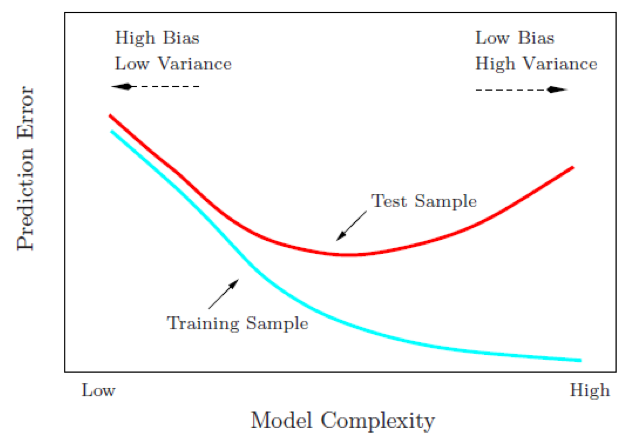

```{r 02-setup, include=FALSE}
# Set global R options
options(htmltools.dir.version = FALSE, servr.daemon = TRUE)

# Set global knitr chunk options
knitr::opts_chunk$set(
  dev = "svg",
  fig.align = "center",
  cache = TRUE,
  error = FALSE,
  message = FALSE, 
  warning = FALSE, 
  collapse = TRUE 
)
```

## Modeling Process

Before introducing specific algorithms, this module introduces concepts that are useful for any type of machine learning model:

- data splitting
- feature engineering
- basic model formulation
- model evaluation
- model tuning


```{r, echo=FALSE}
knitr::include_graphics("Images/modeling_process2.png")
```

---
class: center, middle, inverse

background-image: url(Images/data_spend_icon.jpg)
background-size: cover

# Data Spend

---

## Data splitting

How do we "spend" the data to find an optimal model? 

We _typically_ split data into training and test data sets:

*  ***Training Set***: these data are used to estimate model and tune model parameters.

*  ***Test Set***: having chosen a final model, these data are used to estimate its prediction error (generalization error). These data should _not be used during model training_. 

<br>

```{r, echo=FALSE, fig.align='center'}
knitr::include_graphics("Images/data_split.png")
```

---

## Data splitting

How we spend our data can determine how well our models perform.  

Given a fixed amount of data:

* too much spent in training won't allow us to get a good assessment of predictive performance.  We may find a model that fits the training data very well, but is not generalizable (overfitting)

* too much spent in testing won't allow us to get a good assessment of model parameters

Guidelines...

* Typical splits you hear are 60-40, 70-30, or 80-20.

* Often you hear that size of data determines split.  Partially true; however, also depends on...

    * Signal-to-noise ratio

    * Business decision being answered


---

## Mechanics of Data Splitting

There are a few different ways to do the split: _simple random sampling_ and _stratified sampling_ based on the outcome are the most typical.

For stratification:

* **classification**: this would mean sampling within the classes as to preserve the distribution of the outcome in the training and test sets

* **regression**: determine the quartiles of the data set and samples within those artificial groups

Other types of sampling approaches

* Down/Up sampling

* Snowball sampling

* Synthetic Minority Over-sampling Technique (SMOTE)

* Etc.

---

## Implementation of Data Splitting

```{r sampling}
library(rsample)

# Make sure that you get the same random numbers
set.seed(123)
data_split <- initial_split(pdp::boston, prop = .7, strata = "cmedv")

boston_train <- training(data_split)
boston_test  <- testing(data_split)

nrow(boston_train)/nrow(pdp::boston)
```

---

## Outcome Distribution

```{r sampling_dist, fig.width=8, fig.height=4}
library(ggplot2)

# how do the distributions differ?
ggplot(boston_train, aes(x = cmedv)) + 
  geom_density(trim = TRUE) + 
  geom_density(data = boston_test, trim = TRUE, col = "red") 
```


---

class: center, middle, inverse

background-image: url(http://amsterdammakerfestival.nl/wp-content/uploads/2016/08/the-challenge.png)


---

## Your Turn!

Create training (70%) and test (30%) sets for the `AmesHousing::make_ames()` data. Stratify on the `Sale_Price` variable and visualize this variable for the training and testing sets to see if their distributions are similar.

---

## Solution

```{r solution1, fig.height=2.25}
# Ames housing data
ames <- AmesHousing::make_ames()

# create reproducible splits
set.seed(123)
data_split <- initial_split(ames, prop = .7, strata = "Sale_Price")
ames_train <- training(data_split)
ames_test  <- testing(data_split)
nrow(ames_train)/nrow(ames)

# compare distributions
ggplot(ames_train, aes(x = Sale_Price)) + 
  geom_density(trim = TRUE) + 
  geom_density(data = ames_test, trim = TRUE, col = "red")
```


---

class: center, middle, inverse

background-image: url(Images/engineering_icon.jpg)
background-size: cover

# Feature Engineering

---

## Feature Engineering

Pre-processing our features is often a requirement for many algorithms...plus it can greatly increase performance `r emo::ji("hooray")`

Feature engineering can include:

* transformations of variables

* alternate encodings of a variable

* elimination of low/zero variance predictors

* collapsing of correlated variables

<br><br><br>

.full-width[.content-box-blue[.bolder[.center[Feature engineering can include a wide variety of pre-processing steps, this section covers just a few that you will continuously see throughout this training.]]]]


---

## One-hot encoding

* Some models require all variables to be numeric.

* Some packages automate this process (i.e. `caret`, `h2o`) while others do not (i.e. `glmnet`, `keras`)

* We can one-hot encode with `caret::dummyVars` (provides full-rank encoding and 1-to-1 dummy encoding)

```{r one-hot, eval=FALSE}
# full rank 
full_rank <- dummyVars(~ ., boston_train, fullRank = TRUE)
boston_train <- predict(full_rank, boston_train) %>% as.data.frame()
boston_test  <- predict(full_rank, boston_test) %>% as.data.frame()

# 1-to-1 dummy encode (less than full rank)
one_hot <- dummyVars(~ ., boston_train, fullRank = FALSE) #<<
boston_train <- predict(one_hot, boston_train) %>% as.data.frame()
boston_test  <- predict(one_hot, boston_test) %>% as.data.frame()
```

```{r, echo=FALSE}
# 1-to-1 dummy encode (less than full rank)
one_hot <- dummyVars(~ ., boston_train, fullRank = FALSE)
boston_train <- predict(one_hot, boston_train) %>% as.data.frame()
boston_test  <- predict(one_hot, boston_test) %>% as.data.frame()
```


.full-width[.content-box-blue[.bolder[.center[For classification problems we do not want to one-hot encode our response variable! `r emo::ji("oops")`]]]]


---

## Response Transformation

Adjusting the distribution of variables by using a **transformation** can lead to a big improvement. 


__Normalizing response variable__

```{r, eval=FALSE}
# log transformation
train_y <- log(boston_train$cmedv)
test_y  <- log(boston_test$cmedv)

# Box Cox transformation
lambda  <- forecast::BoxCox.lambda(boston_train$cmedv) #<<
train_y <- forecast::BoxCox(boston_train$cmedv, lambda)
test_y  <- forecast::BoxCox(boston_test$cmedv, lambda)

# Inverse Box Cox
inv_box_cox <- function(x, lambda) {
  if (lambda == 0) exp(x) else (lambda*x + 1)^(1/lambda) 
}
```


.full-width[.content-box-blue[.bolder[.center[We use training set lambda to minimize data leakage! `r emo::ji("droplet")`]]]]


---

## Feature Transformation

Adjusting the distribution of variables by using a **transformation** can lead to a big improvement. 

__Normalizing features__

* Some models (_K_-NN, SVMs, PLS, neural networks) require that the features have the same units. **Centering** and **scaling** can be used for this purpose. 

* Its important to standardize the test feature sets based on the mean and standard deviation of the training features to minimize data leakage.


```{r, eval=FALSE}
features <- setdiff(names(boston_train), "cmedv")

# pre-process estimation based on training features
pre_process <- caret::preProcess(
  x      = boston_train[, features],
  method = c("BoxCox", "center", "scale")    #<<
  )

# apply to both training & test
train_x <- predict(pre_process, boston_train[, features])
test_x  <- predict(pre_process, boston_test[, features])
```


---

## Alternative Feature Transformation

* Removing near-zero or zero variance variables

* Collapsing highly correlated variables with PCA

* etc.

```{r, eval=FALSE}
features <- setdiff(names(boston_train), "cmedv")

# pre-process estimation based on training features
pre_process <- caret::preProcess(
  x      = boston_train[, features],
  method = c("BoxCox", "center", "scale", "pca", "nzv", "zv")  #<<
  )

# apply to both training & test
train_x <- predict(pre_process, boston_train[, features])
test_x  <- predict(pre_process, boston_test[, features])
```


.full-width[.content-box-blue[.bolder[.center[Check out `?caret::preProcess` for the many options it offers.]]]]


---

class: center, middle, inverse

background-image: url(http://amsterdammakerfestival.nl/wp-content/uploads/2016/08/the-challenge.png)


---

## Your Turn!

Perform the following feature engineering on your Ames data:

* __Response variable__

  - Normalize
  
* __Predictor variables__

  - One-hot encode
  
  - Standardize (center & scale)
  
  - Remove zero-variance variables
  
---

## Solution

__Normalize response variable__

```{r solution2a, fig.height=3.5, fig.width=9}
# transform response
lambda  <- forecast::BoxCox.lambda(ames_train$Sale_Price)
train_y <- forecast::BoxCox(ames_train$Sale_Price, lambda)
test_y  <- forecast::BoxCox(ames_test$Sale_Price, lambda)

# compare
par(mfrow = c(1, 2))
hist(ames_train$Sale_Price, breaks = 30, main = "Untransformed")
hist(train_y, breaks = 30, main = "Transformed")
```


---

## Solution

__Predictor variables__

```{r solution2b}
# one-hot encode
one_hot <- dummyVars(~ ., ames_train, fullRank = FALSE)
train_x <- predict(one_hot, ames_train) %>% as.data.frame()
test_x  <- predict(one_hot, ames_test) %>% as.data.frame()

# pre-processing steps
pre_process <- caret::preProcess(
  train_x,
  method = c("center", "scale", "zv")
)

# apply pre-processing
train_x <- predict(pre_process, train_x)
test_x  <- predict(pre_process, test_x)

# common dimensions
dim(train_x)
dim(test_x)
```


---
class: center, middle, inverse

background-image: url(Images/model_formulation.jpg)
background-size: cover

# Model Formulation

---


## Packages used

* There are ___many___ packages to perform machine learning and there are almost always more than one to perform each algorithm.

* There are often pros and cons for each package

* This training will try to expose you to many of the more common packages for each algorithm but realize there are *more ways than one to skin a* `r emo::ji("scream_cat")`

.scrollable[

.pull-left[

**Built-in `lm` approach:**

```{r}
m1.base <- lm(cmedv ~ ., data = boston_train)

summary(m1.base)
```


]

.pull-right[

**`caret` approach:**

```{r}
library(caret)

m1.caret <- train(cmedv ~ ., data = boston_train, method = "lm")

summary(m1.caret)
```

]
]

---

## Model Specification

* There are two primary ways we'll specify model formulation

* Typically, the non-formula matrix approach is more efficient computationally

.pull-left[

**Formula Interface:**

```{r, eval=FALSE}
lm(y ~ x1 + x2, data = train)
lm(y ~ ., data = train)
lm(log(y) ~ ., data = train)
```


]

.pull-right[

**Non-formula ("matrix") Interface:**

```{r, eval=FALSE}
glmnet(x = train_x, y = train_y)
```

]


<br><br>

.full-width[.content-box-blue[.bolder[.center[Not all machine learning functions have both interfaces. `r emo::ji("face with symbols on mouth")`]]]]


---
class: center, middle, inverse

background-image: url(Images/tuning-your-guitar.jpg)
background-size: cover

# Model Tuning

---

## Tuning Parameters

* Hyperparameters control the level of model complexity.

.pull-left[

* Regularized regression
   * `alpha` (mixing %)
   * `lambda` (regularization)

* MARS
   * `nprune` (# terms)
   * `degree` (product degree)

* Neural Nets
   * `size` (# hidden units) 
   * `decay` (weight decay)
   
]

.pull-right[

* Discriminant Analysis
   * `model` (type)
   * `dimen` (discriminant fx)

* SVMs
   * `sigma` 
   * `cost` 
   * `weight` 

* Trees
   * `mtry` (randomly selected variables)
   * `ntrees` (# trees)
   * `max_depth` (tree depth)

]

---

## Tuning Parameters

* Hyperparameters control the level of model complexity.

* This is good as it allows us to transform our model to better align with patterns within our data.

<br><br>

```{r, echo=FALSE, fig.width=5.25, fig.height=3.15, fig.align='left'}
p1 <- ggplot(boston_train, aes(crim, cmedv)) +
  geom_point(size = 1) +
  geom_smooth(method = "lm", se = FALSE) +
  scale_x_log10() +
  scale_y_log10()

p2 <- ggplot(boston_train, aes(crim, cmedv)) +
  geom_point(size = 1) +
  geom_smooth(se = FALSE) +
  scale_x_log10() +
  scale_y_log10()


gridExtra::grid.arrange(p1, p2, nrow = 1)
```

---

## Tuning Parameters

* Hyperparameters control the level of model complexity.

* This is good as it allows us to transform our model to better align with patterns within our data.

* However, it can be bad because we can overfit our model to training data, which will not generalize well.

```{r, echo=FALSE, fig.width=10, fig.height=4, fig.align='left'}
p1 <- ggplot(boston_train, aes(crim, cmedv)) +
  geom_point() +
  geom_smooth(method = "lm", se = FALSE) +
  scale_x_log10() +
  scale_y_log10()

p2 <- ggplot(boston_train, aes(crim, cmedv)) +
  geom_point() +
  geom_smooth(se = FALSE) +
  scale_x_log10() +
  scale_y_log10()

p3 <- ggplot(boston_train, aes(crim, cmedv)) +
  geom_point() +
  geom_smooth(se = FALSE, span = .05) +
  scale_x_log10() +
  scale_y_log10()

gridExtra::grid.arrange(p1, p2, p3, nrow = 1)
```

---

## Tuning Parameters

* Hyperparameters control the level of model complexity.

* This is good as it allows us to transform our model to better align with patterns within our data.

* However, it can be bad because we can overfit our model to training data, which will not generalize well.

<center>

</center>


---
class: center, middle, inverse

background-image: url(Images/resampling_icon.jpg)
background-size: cover

# Resampling

---

## Cross Validation for Generalization

* Our goal is to not only find a model that performs well on training data but...

* to find one that performs well on _future unseen data_.

<br>

```{r, echo=FALSE, fig.height=3.5}
knitr::include_graphics("Images/cv.png")
```

---

## Custom CV

* Some packages/functions do not have built-in CV capabilities

* `lm` does not have built-in CV capabilities but we can use `rsample`

```{r}
set.seed(123)
{{cv_split <- vfold_cv(pdp::boston, v = 10, strata = "cmedv")}}

cv_split
```

---

## Custom CV

* Some packages/functions do not have built-in CV capabilities

* `lm` does not have built-in CV capabilities but we can use `rsample`

```{r}
cv_split <- vfold_cv(boston_train, v = 10)

# create empty vector to store error metric
rmse <- vector(mode = "numeric", length = nrow(cv_split))

# iterate through each fold, model, predict, score
for (i in 1:nrow(cv_split)) {
  m <- lm(cmedv ~ ., data = analysis(cv_split$splits[[i]]))
  p <- predict(m, assessment(cv_split$splits[[i]]))
  rmse[i] <- caret::RMSE(p, assessment(cv_split$splits[[i]])$cmedv)
}

mean(rmse)
```

---

## Built-in CV

Many model functions, like `caret`, have built-in CV capabilities

.scrollable[

```{r}
m2.caret <- train(
  cmedv ~ ., 
  data = boston_train, 
  method = "lm",
  trControl = trainControl(method = "cv", number = 10) #<<
  )

m2.caret
```
]


---
class: center, middle, inverse

background-image: url(Images/evaluation_icon.jpg)
background-size: cover

# Model Evaluation

---

## Performance Metrics

.pull-left[

**Regression:**

* Mean Square Error (MSE)
* Mean Absolute Error (MAE)
* Mean Absolute Percent Error (MAPE)
* Root Mean Squared Logarithmic Error (RMSLE)


]

.pull-right[

**Classification:**

* Classification Accuracy
* Recall vs. Specificity
* $F_1$ Score
* Log Loss

]

---

## Performance Metrics


.pull-left[

**Regression:**

* **Mean Square Error (MSE)**
* Mean Absolute Error (MAE)
* Mean Absolute Percent Error (MAPE)
* Root Mean Squared Logarithmic Error (RMSLE)

<br><br>

$$ MSE = \frac{1}{n} \sum^n_{i=1}(y_i - \hat y_i)^2 $$

]

.pull-right[

**Classification:**

* **Classification Accuracy**
* Recall vs. Specificity
* $F_1$ Score
* Log Loss


```{r, echo=FALSE}
knitr::include_graphics("https://rasbt.github.io/mlxtend/user_guide/evaluate/confusion_matrix_files/confusion_matrix_1.png")
```


]

---

class: center, middle, inverse

background-image: url(http://amsterdammakerfestival.nl/wp-content/uploads/2016/08/the-challenge.png)


---

## Your Turn!

Starting with the raw `AmesHousing::make_ames()` data:

1. split your data into 70 (training) / 30 (testing)
2. normalize the response variable
3. standardize the features (don't one-hot encode as `lm` will automate the dummy encoding)
4. apply a linear regression model with 10-fold cross validation
5. what is your average CV RMSE?   

---

## Solution

.scrollable[

```{r baseline_solution}

# 1. 70/30 split
data_split <- initial_split(AmesHousing::make_ames(), prop = .7, strata = "Sale_Price")
ames_train <- training(data_split)
ames_test  <- testing(data_split)

# 2. normalize response variable
lambda  <- forecast::BoxCox.lambda(ames_train$Sale_Price)
train_y <- forecast::BoxCox(ames_train$Sale_Price, lambda)
test_y  <- forecast::BoxCox(ames_test$Sale_Price, lambda)

# 3. standardize features
features <- setdiff(names(ames_train), "Sale_Price")
pre_process <- preProcess(
  x = ames_train[, features],
  method = c("YeoJohnson", "center", "scale", "zv")
)
train_x <- predict(pre_process, ames_train[, features])
test_x  <- predict(pre_process, ames_test[, features])

# 4. 10-fold CV linear regression
lm.cv <- train(
  x =  train_x,
  y = train_y,
  method = "lm",
  trControl = trainControl(method = "cv", number = 10)
  )

# 5. out-of-sample avg CV RMSE
lm.cv
```

]

---

## So, can we do better?

```{r, echo=FALSE}

```


---

## Peeking inside the black box

.full-width[.content-box-yellow[.center[What insights do we generally want to extract from our ML models?]]]

--

* Which variables are important? ([`vip`](https://github.com/koalaverse/vip))

--

* How does each feature functionallr relate to the outcome of interest? ([`pdp`](https://github.com/bgreenwell/pdp), [`plotmo`](https://CRAN.R-project.org/package=plotmo), [`ICEbox`](https://CRAN.R-project.org/package=ICEbox))

--

* How do the features interact? ([`pdp`](https://github.com/bgreenwell/pdp), [`plotmo`](https://CRAN.R-project.org/package=plotmo), [`ICEbox`](https://CRAN.R-project.org/package=ICEbox))

--

```{r peeking-demo, echo=FALSE, fig.width=8, fig.height=2}
# Load required packages
library(ggplot2)
library(pdp)
library(ranger)
library(vip)

# Load the Boston housing data
data(boston)

# Fit a random forest to the Boston housing data
set.seed(2048)
rf <- ranger(cmedv ~ ., data = boston, importance = "permutation")

# Plots
p1 <- vip(rf, num_features = 15)
p2 <- partial(rf, pred.var = "lstat") %>% autoplot()
p3 <- partial(rf, pred.var = c("rm", "lstat"), chull = TRUE) %>% autoplot()
grid.arrange(p1, p2, p3, ncol = 3)
```


---

## Variable importance plots

.pull-left[

* Some ML algorithms provide variable importance measures, but not all R implementations provide variable importance plots (VIPs)

* Enter...[`vip`](https://github.com/AFIT-R/vip) 

    - Provides a consistent framework for extracting and plotting variable importance scores from many types of ML models

    - `vi()` always returns a [tibble](https://cran.r-project.org/web/packages/tibble/vignettes/tibble.html)

    - `vip()` uses [`ggplot2`](http://ggplot2.org/)

]

.pull-right[

```{r vip-install, eval=FALSE}
# Not yet on CRAN (experimental)
devtools::install_github("koalaverse/vip")
```

```{r vip-badge, echo=FALSE, out.width="80%"}
knitr::include_graphics("Images/vip-logo.svg")
```
]


---

## Variable importance plots

```{r vip-code, eval=FALSE}
# Load required packages
library(ranger)
library(vip)

# Load the Ames housing data
ames <- AmesHousing::make_ames()

# Fit a random forest
set.seed(2024)
rf <- ranger(Sale_Price ~ ., data = ames, importance = "impurity")

# Variable importance plot
vip(rf, num_features = 25)  #<<
```

.full-width[.content-box-blue[.bolder[.center[One function to rule them all!]]]]

---

## Variable importance plots

```{r vip-output, echo=FALSE, out.width="60%"}
# Load required packages
library(ranger)
library(vip)

# Load the Ames housing data
ames <- AmesHousing::make_ames()

# Fit a random forest
set.seed(2024)
rf <- ranger(Sale_Price ~ ., data = ames, importance = "impurity")

# Variable importance plot
vip(rf, num_features = 25)
```


---

## Partial dependence plots

.scrollable[

* [Partial dependence plots (PDPs)](https://journal.r-project.org/archive/2017/RJ-2017-016/index.html) help visualize the relationship between a subset of the features (typically 1-3) and the response

* Let $x_1$ be the predictor variable of interest with unique values $\left\{x_{11}, x_{12}, \dots, x_{1k}\right\}$

* The partial dependence of the response on $x_1$ can be constructed as follows:

    1. For $i \in \left\{1, 2, \dots, k\right\}$:
    
        a. Copy the training data and replace the original values of $x_1$ with the constant $x_{1i}$
    
        b. Compute the vector of predicted values from the modified copy of the training data
        
        c. Compute the average prediction to obtain $\bar{f}_1\left(x_{1i}\right)$

    2. Plot the pairs $\left\{x_{1i}, \bar{f}_1\left(x_{1i}\right)\right\}$ for $i = 1, 2, \dotsc, k$

]


---

## Partial dependence plots

.pull-left[

* Very few ML packages in R provide support for constructing PDPs

* Enter...[`pdp`](https://journal.r-project.org/archive/2017/RJ-2017-016/index.html)

    - Provides a consistent way of constructing PDPs (and more) from many types of ML models (not just RFs)

    - Allows for multivariate displays (i.e., interactions) and so much more!!
    
    - Includes options for **parallel processing** and **progress bars** `r emo::ji("sunglasses")`

]

.pull-right[

```{r, eval=FALSE}
# Install from CRAN
install.packages("pdp")

# Install from GitHub
devtools::install_github("bgreenwell/pdp")
```

```{r, echo=FALSE, out.width="65%"}

```

]


---

## A handy flow chart

```{r 02-flow-chart, echo=FALSE, out.width="100%"}
knitr::include_graphics("Images/flow-chart.png")
```


---
class: inverse, middle, center

# Questions?
