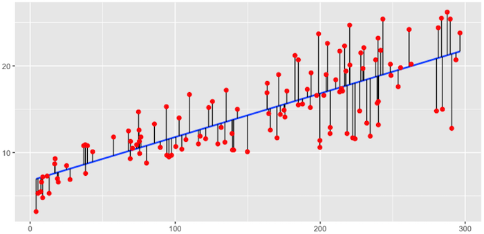
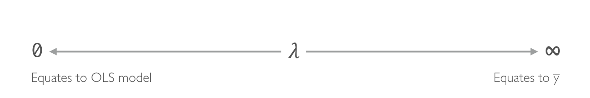
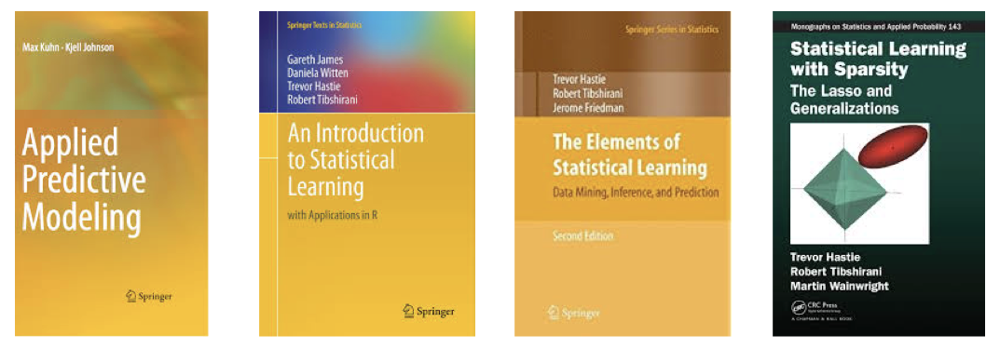

class: center, middle, inverse

background-image: url(Images/overview_icon.jpg)
background-size: cover

# Overview


```{r setup, include=FALSE}
# Set global R options
options(htmltools.dir.version = FALSE, servr.daemon = TRUE)

# Set global knitr chunk options
knitr::opts_chunk$set(
  fig.align = "center",
  #fig.path = "images/", 
  #cache = TRUE,
  dev = "svg",
  error = FALSE,
  message = FALSE, 
  warning = FALSE, 
  collapse = FALSE 
)
```

---

## OLS Regression

```{r, echo=FALSE}

```


* Model form: $y_i = \beta_0 + \beta_{1}x_{i1} + + \beta_{2}x_{i2} \cdots + \beta_{p}x_{ip} + \epsilon_i$

* Objective function: $\text{minimize} \bigg \{ SSE = \sum^n_{i=1} (y_i - \hat{y}_i)^2 \bigg \} \equiv \text{minimize MSE}$

---

## OLS Regression

Some key assumptions we make when working with OLS regression:

* Linear relationship

* Multivariate normality

* No autocorrelation

* Homoscedastic (constant variance in residuals) 

* $p < n$ (there is no unique solution when $p > n$)

* No or little multicollinearity

<br><br>

.full-width[.content-box-blue[.bolder[.center[
Under standard assumptions, the coefficients produced by OLS are unbiased and, of all unbiased linear techniques, have the lowest variance. `r emo::ji("smile")`]]]]


---

## OLS Regression

__However__, as $p$ grows there are three main issues we most commonly run into:

1. Multicollinearity `r emo::ji("face with symbols on mouth")`

2. Insufficient solution `r emo::ji("confused")`

3. Interpretability `r emo::ji("ignorance")`


---

## Multicollinearity 

As *p* increases $\rightarrow$ multicollinearity $\rightarrow$ high variability in our coefficient terms.

```{r, echo=FALSE}
# create training data
ames_split <- rsample::initial_split(AmesHousing::make_ames(), prop = .7, strata = "Sale_Price")
ames_train <- rsample::training(ames_split)
```

```{r, collapse=TRUE}
# train models with strongly correlated variables
m1 <- lm(Sale_Price ~ Gr_Liv_Area + TotRms_AbvGrd, data = ames_train)
m2 <- lm(Sale_Price ~ Gr_Liv_Area, data = ames_train)
m3 <- lm(Sale_Price ~ TotRms_AbvGrd, data = ames_train)

coef(m1) #<<
coef(m2) #<<
coef(m3) #<<
```


.full-width[.content-box-blue[.bolder[.center[
Causes overfitting, which means we have high variance in the bias-variance tradeoff space. `r emo::ji("face with symbols on mouth")`
]]]]


---

## Insufficient Solution

When $p > n$ $\rightarrow$ OLS solution matrix is *not* invertible $\rightarrow$:

1. infinite solution sets, most of which overfit data,

2. computationally infeasible.


<br><br><br><br><br><br><br>

.full-width[.content-box-blue[.bolder[.center[
Leads to more frustration and confusion! `r emo::ji("confused")`
]]]]


---

## Interpretability

With a large number of features, we often would like to identify a smaller subset of these features that exhibit the strongest effects.

* Approach 1: model selection
    - computationally inefficient (Ames data: $2^{80}=1.208926E+24$ models to evaluate)
    - simply assume a feature as in or out $\rightarrow$ *hard threshholding*

* Approach 2: 
    - retain all coefficients
    - slowly pushes a feature's effect towards zero $\rightarrow$ *soft threshholding*
    
<br><br><br>

.full-width[.content-box-blue[.bolder[.center[
Without interpretability we just have accuracy! `r emo::ji("ignorance")`
]]]]


---

## Regularized Regression

One alternative to OLS regression is to use regularized regression (aka *penalized* models or *shrinkage* methods)

.large[

$$\text{minimize } \big \{ SSE + P \big \}$$

]

* Constrains magnitude of the coefficients

* Progressively shrinks coefficients to zero

* Reduces variability of coefficients (pulls correlated coefficients together)

<br><br><br><br><br>

.full-width[.content-box-blue[.bolder[.center[
Reduces variance of model, which can also reduce error! `r emo::ji("hooray")`
]]]]


---

class: center, middle, inverse

background-image: url(Images/ridge_icon.jpg)
background-size: cover

# Ridge Regression

---

## Ridge regression: the idea

$$\text{Objective function: minimize } \bigg \{ SSE + \lambda \sum^p_{j=1} \beta_j^2 \bigg \}$$

---

## Ridge regression: the idea

$$\text{Objective function: minimize } \bigg \{ SSE + \lambda \sum^p_{j=1} \beta_j^2 \bigg \}$$

<br><br><br><br>

```{r, echo=FALSE}

```

---

## Ridge regression: the idea

$$\text{Objective function: minimize } \bigg \{ SSE + \lambda \sum^p_{j=1} \beta_j^2 \bigg \}$$

```{r, echo=FALSE, fig.width=7, fig.height=5}
boston <- pdp::boston
train_x <- model.matrix(cmedv ~ ., boston)[, -1]
train_y <- boston$cmedv
boston_ridge <- glmnet::glmnet(
  x = train_x,
  y = train_y,
  alpha = 0
)
plot(boston_ridge, xvar = "lambda")
```


---

## Ridge regression: implementation

**Packages used:**

```{r}
library(rsample)  # data splitting & resampling
library(tidyr)    # data manipulation
library(dplyr)    # data manipulation
library(ggplot2)  # visualization
library(caret)    # data prep
{{library(glmnet)}}   # implementing regularized regression approaches
```

**Data used:**

```{r}
boston <- pdp::boston             # example data
ames <- AmesHousing::make_ames()  # exercise data
```

---

## Ridge regression: implementation

**Data prep:**

.scrollable[

```{r, collapse=TRUE}
# create sample splits
set.seed(123)
data_split <- initial_split(boston, prop = .7, strata = "cmedv")

boston_train <- training(data_split)
boston_test  <- testing(data_split)

# create feature sets
one_hot <- caret::dummyVars(cmedv ~ ., data = boston_train, fullRank = TRUE) #<<
train_x <- predict(one_hot, boston_train) #<<
train_y <- boston_train$cmedv #<<

test_x <- predict(one_hot, boston_test)
test_y <- boston_test$cmedv

# dimension of training feature set
dim(train_x)
```

.full-width[.content-box-blue[.bolder[.center[
`glmnet` does not use the formula method (<code>y ~ x</code>) so prior to modeling we need to create our feature and target set.
]]]]

]

---

class: center, middle, inverse

background-image: url(http://amsterdammakerfestival.nl/wp-content/uploads/2016/08/the-challenge.png)


---

## Your Turn!

1. Create training (70%) and test (30%) sets for the `AmesHousing::make_ames()` data.  Use `set.seed(123)` to match my output.

2. Create training and testing feature model matrices and response vectors.

3. What is the dimension of of your feature matrix?

---

## Solution: Preparing data

```{r challenge_1, collapse=TRUE}
# Create training (70%) and test (30%) sets for the AmesHousing::make_ames() data.
# Use set.seed(123)

set.seed(123)
ames_split <- initial_split(AmesHousing::make_ames(), prop = .7, strata = "Sale_Price")
ames_train <- training(ames_split)
ames_test  <- testing(ames_split)

# Create training and testing feature model matrices and response vectors.
ames_one_hot <- caret::dummyVars(Sale_Price ~ ., data = ames_train, fullRank = TRUE)
ames_train_x <- predict(ames_one_hot, ames_train)
ames_train_y <- log(ames_train$Sale_Price)

ames_test_x <- predict(ames_one_hot, ames_test)
ames_test_y <- log(ames_test$Sale_Price)

# What is the dimension of of your feature matrix?
dim(ames_train_x)
```

---

## Ridge regression: implementation

To apply a Ridge model we can use the `glmnet::glmnet` function

- Ridge: <font color = "red"><code>alpha = 0</code></font>, Lasso: `alpha = 1`, elastic net: <code>0 $\leq$ alpha $\leq$ 1</code>
- essential that predictor variables are standardized (`standardize = TRUE`)
- `glmnet` performs Ridge across wide range of $\lambda$

.scrollable[

.pull-left[

```{r, fig.width=4, fig.height=3}
## fit ridge regression
boston_ridge <- glmnet(
  x = train_x,
  y = train_y,
  alpha = 0 #<<
)

plot(boston_ridge, xvar = "lambda")
```

]

.pull-right[

```{r, collapse=TRUE}
## lambdas applied
boston_ridge$lambda
```

]

<br><br>

]


---

## Ridge regression: implementation

We can also directly access the coefficients for a model using `coef`:

.scrollable[

.pull-left[

```{r, collapse=TRUE}
# small lambda = big coefficients
tidy(coef(boston_ridge)[, 100])
```

]

.pull-right[

```{r, collapse=TRUE}
# big lambda = small coefficients
tidy(coef(boston_ridge)[, 1])
```

]


<center>
<bold>
<font color="red">
What's the best $\lambda$ value? How much improvement are we experiencing with our model?
</font>
</bold>
</center>

<br>

]

---

## Ridge regression: tuning

* $\lambda$: tuning parameter that helps control our model from over-fitting to the training data
* to identify the optimal $\lambda$ value we need to perform cross-validation
* `cv.glmnet` provides a built-in option to perform k-fold CV

.scrollable[

```{r, fig.width=7, fig.height=5}
## fit CV ridge regression
boston_ridge <- cv.glmnet(
  x = train_x,
  y = train_y,
  alpha = 0,
  nfolds = 10 #<<
)

## plot CV MSE
plot(boston_ridge)
```

<br>

]

---

## Ridge regression: tuning

.scrollable[

```{r, collapse=TRUE}
# minimum MSE and respective lambda
min(boston_ridge$cvm)      
boston_ridge$lambda.min     

# MSE and respective lambda within 1 standard error of minimum MSE
boston_ridge$cvm[boston_ridge$lambda == boston_ridge$lambda.1se]
boston_ridge$lambda.1se 
```

```{r, echo=FALSE, fig.width=6, fig.height=4}
boston_ridge2 <- glmnet(
  x = train_x,
  y = train_y,
  alpha = 0
)
plot(boston_ridge2, xvar = "lambda")
abline(v = log(boston_ridge$lambda.min), col = "red", lty = "dashed")
abline(v = log(boston_ridge$lambda.1se), col = "red", lty = "dashed")
```

]

---

## Ridge regression: <font color = "green">pros</font>

The Ridge regression model:

* pushes many of the correlated features towards each other rather than allowing for one to be wildly positive and the other wildly negative.

* non-important features have been pushed closer to zero...minimizing noise

* <font color = "green">provides us more clarity in identifying the true signals in our model.</font>

---

## Ridge regression: <font color = "green">pros</font>

.scrollable[


```{r, fig.height=3, fig.width=4}
coef(boston_ridge, s = "lambda.1se") %>%
  tidy() %>%
  filter(row != "(Intercept)") %>%
  ggplot(aes(value, reorder(row, value))) +
  geom_point() +
  ggtitle("Rank-order of variable influence") +
  xlab("Coefficient") +
  ylab(NULL)
```

]

---

## Ridge regression: <font color = "red">cons</font>

The Ridge regression model:

* retains <bold><font color="red">all</font></bold> variables

* does not perform feature selection

---

class: center, middle, inverse

background-image: url(http://amsterdammakerfestival.nl/wp-content/uploads/2016/08/the-challenge.png)


---

## Your Turn!

1. Apply a 10-fold CV Ridge regression model to ames data.

2. What is the $\lambda$ value with the lowest MSE?

3. What is the $\lambda$ value within 1 standard error of the lowest MSE?

---

## Solution: Preparing data

.scrollable[

```{r, fig.width=7, fig.height=5}
## Apply CV Ridge regression to ames data
ames_ridge <- cv.glmnet(
  x = ames_train_x,
  y = ames_train_y,
  alpha = 0
)

plot(ames_ridge)
```

]

---

## Solution: Preparing data

.scrollable[

```{r, collapse=TRUE}
# minimum MSE and respective lambda
min(ames_ridge$cvm)      
ames_ridge$lambda.min     

# MSE and respective lambda within 1 standard error of minimum MSE
ames_ridge$cvm[ames_ridge$lambda == ames_ridge$lambda.1se]
ames_ridge$lambda.1se 
```

```{r, echo=FALSE, fig.width=6, fig.height=4}
ames_ridge2 <- glmnet(
  x = ames_train_x,
  y = ames_train_y,
  alpha = 0
)
plot(ames_ridge2, xvar = "lambda")
abline(v = log(ames_ridge$lambda.min), col = "red", lty = "dashed")
abline(v = log(ames_ridge$lambda.1se), col = "red", lty = "dashed")
```

]

---

class: center, middle, inverse

background-image: url(Images/lasso_icon.jpg)
background-size: cover

# Lasso Regression

## least absolute shrinkage and selection operator

---

## Lasso regression: the idea

.scrollable[

$$\text{Objective function: minimize } \bigg \{ SSE + \lambda \sum^p_{j=1} | \beta_j | \bigg \}$$

```{r, echo=FALSE, fig.width=6, fig.height=4}
boston <- pdp::boston
train_x <- model.matrix(cmedv ~ ., boston)[, -1]
train_y <- boston$cmedv
boston_ridge <- glmnet::glmnet(
  x = train_x,
  y = train_y,
  alpha = 1
)
plot(boston_ridge, xvar = "lambda")
```

.full-width[.content-box-blue[.bolder[.center[
Will actually push coefficients to zero...great for automated feature selection!
]]]]

]

---

## Lasso: implementation

.scrollable[

To apply a Lasso model we can use the `glmnet::glmnet` function

- Ridge: `alpha = 0` Lasso: <font color = "red"><code>alpha = 1</code></font>, elastic net: <code>0 $\leq$ alpha $\leq$ 1</code>
- essential that predictor variables are standardized
- `glmnet` performs Lasso across wide range of $\lambda$


```{r, fig.width=4, fig.height=3}
## fit lasso regression
boston_lasso <- glmnet(
  x = train_x,
  y = train_y,
  alpha = 1 #<<
)

plot(boston_lasso, xvar = "lambda")
```


]


---

## Lasso: tuning

.full-width[.content-box-yellow[.bolder[.center[
We can use the same operations as we did with Ridge regression to perform CV.
]]]]

.scrollable[

```{r, fig.width=7, fig.height=5}
## fit CV lasso regression
boston_lasso <- cv.glmnet(
  x = train_x,
  y = train_y,
  alpha = 1
)

## plot CV MSE
plot(boston_lasso)
```

]

---

class: center, middle, inverse

background-image: url(http://amsterdammakerfestival.nl/wp-content/uploads/2016/08/the-challenge.png)


---

## Your Turn!

1. Apply a 10-fold CV Lasso regression model to ames data.

2. What is the $\lambda$ value with the lowest MSE?

3. What is the $\lambda$ value within 1 standard error of the lowest MSE?

---

## Solution: Preparing data

.scrollable[

```{r, fig.width=7, fig.height=5}
## Apply CV Lasso regression to ames data
ames_lasso <- cv.glmnet(
  x = ames_train_x,
  y = ames_train_y,
  alpha = 1
)

plot(ames_lasso)
```

]

---

## Solution: Preparing data

.scrollable[

```{r, collapse=TRUE}
# minimum MSE and respective lambda
min(ames_lasso$cvm)      
ames_lasso$lambda.min     

# MSE and respective lambda within 1 standard error of minimum MSE
ames_lasso$cvm[ames_lasso$lambda == ames_lasso$lambda.1se]
ames_lasso$lambda.1se 
```

```{r, echo=FALSE, fig.width=6, fig.height=4}
ames_lasso2 <- glmnet(
  x = ames_train_x,
  y = ames_train_y,
  alpha = 1
)
plot(ames_lasso2, xvar = "lambda")
abline(v = log(ames_lasso$lambda.min), col = "red", lty = "dashed")
abline(v = log(ames_lasso$lambda.1se), col = "red", lty = "dashed")
```

]


---

class: center, middle, inverse

background-image: url(Images/elastic_net_icon.jpg)
background-size: cover

# Elastic nets


---

## Elastic nets: the idea

$$\text{Objective function: minimize } \bigg \{ SSE + \lambda_1 \sum^p_{j=1} \beta_j^2 + \lambda_2 \sum^p_{j=1} | \beta_j | \bigg \}$$

<br><br><br><br>

.full-width[.content-box-yellow[.bolder[.center[
Enables effective regularization via the ridge penalty with the feature selection characteristics of the lasso penalty!
]]]]


---

## Elastic nets: implementation

.scrollable[

```{r, eval=FALSE}
lasso    <- glmnet(train_x, train_y, alpha = 1.0) 
elastic1 <- glmnet(train_x, train_y, alpha = 0.25) #<<
elastic2 <- glmnet(train_x, train_y, alpha = 0.75) #<<
ridge    <- glmnet(train_x, train_y, alpha = 0.0)
```

```{r, fig.height=7, fig.width=9, echo=FALSE}
lasso    <- glmnet(train_x, train_y, alpha = 1.0) 
elastic1 <- glmnet(train_x, train_y, alpha = 0.25) #<<
elastic2 <- glmnet(train_x, train_y, alpha = 0.75) #<<
ridge    <- glmnet(train_x, train_y, alpha = 0.0)

par(mfrow = c(2, 2), mar = c(6, 4, 6, 2) + 0.1)
plot(lasso, xvar = "lambda", main = "Lasso (Alpha = 1)\n\n\n")
plot(elastic1, xvar = "lambda", main = "Elastic Net (Alpha = .25)\n\n\n")
plot(elastic2, xvar = "lambda", main = "Elastic Net (Alpha = .75)\n\n\n")
plot(ridge, xvar = "lambda", main = "Ridge (Alpha = 0)\n\n\n")
```

]

---

## Elastic nets: tuning

Two tuning parameters:

* $\lambda$

* `alpha`

.scrollable[

```{r, eval=FALSE}
fold_id <- sample(1:10, size = length(train_y), replace=TRUE)

cv_lasso    <- cv.glmnet(train_x, train_y, alpha = 1.0, foldid = fold_id) 
cv_elastic1 <- cv.glmnet(train_x, train_y, alpha = 0.3, foldid = fold_id) #<<
cv_elastic2 <- cv.glmnet(train_x, train_y, alpha = 0.6, foldid = fold_id) #<<
cv_ridge    <- cv.glmnet(train_x, train_y, alpha = 0.0, foldid = fold_id)
```

```{r, fig.height=7, fig.width=9, echo=FALSE}
fold_id <- sample(1:10, size = length(train_y), replace=TRUE)

cv_lasso    <- cv.glmnet(train_x, train_y, alpha = 1.0, foldid = fold_id) 
cv_elastic1 <- cv.glmnet(train_x, train_y, alpha = 0.3, foldid = fold_id) #<<
cv_elastic2 <- cv.glmnet(train_x, train_y, alpha = 0.6, foldid = fold_id) #<<
cv_ridge    <- cv.glmnet(train_x, train_y, alpha = 0.0, foldid = fold_id)

par(mfrow = c(2, 2), mar = c(6, 4, 6, 2) + 0.1)
plot(cv_lasso, xvar = "lambda", main = "Lasso (Alpha = 1)\n\n\n")
plot(cv_elastic1, xvar = "lambda", main = "Elastic Net (Alpha = .3)\n\n\n")
plot(cv_elastic2, xvar = "lambda", main = "Elastic Net (Alpha = .6)\n\n\n")
plot(cv_ridge, xvar = "lambda", main = "Ridge (Alpha = 0)\n\n\n")
```

]

---

## Elastic nets: tuning

.scrollable[

```{r, fig.height=3, fig.width=5}
# tuning grid
tuning_grid <- tibble::tibble(
  alpha     = seq(0, 1, by = .1),
  mse_min  = NA,
  mse_1se  = NA
)

for(i in seq_along(tuning_grid$alpha)) {
  
  # fit CV model for each alpha value
  fit <- cv.glmnet(train_x, train_y, alpha = tuning_grid$alpha[i], foldid = fold_id)
  
  # extract MSE and lambda values
  tuning_grid$mse_min[i] <- fit$cvm[fit$lambda == fit$lambda.min]
  tuning_grid$mse_1se[i] <- fit$cvm[fit$lambda == fit$lambda.1se]
}

tuning_grid %>%
  mutate(se = mse_1se - mse_min) %>%
  ggplot(aes(alpha, mse_min)) +
  geom_line(size = 2) +
  geom_ribbon(aes(ymax = mse_min + se, ymin = mse_min - se), alpha = .25) +
  ggtitle("MSE ± one standard error")
```

]


---

class: center, middle, inverse

background-image: url(http://amsterdammakerfestival.nl/wp-content/uploads/2016/08/the-challenge.png)


---

## Your Turn!

1. Apply an elastic net model to the ames data.

2. Which value of `alpha` performs best?

3. Can you identify the most influential features?

---

## Solution: Compare performance

.scrollable[

```{r, fig.height=3, fig.width=5}
# reproducible CV splits
fold_id <- sample(1:10, size = length(ames_train_y), replace=TRUE)

# tuning grid
tuning_grid <- tibble::tibble(
  alpha      = seq(0, 1, by = .1),
  mse_min   = NA,
  mse_1se   = NA,
  lambda_min = NA,
  lambda_1se = NA
)

# modeling
for(i in seq_along(tuning_grid$alpha)) {
  fit <- cv.glmnet(ames_train_x, ames_train_y, alpha = tuning_grid$alpha[i], foldid = fold_id)
  tuning_grid$mse_min[i]   <- fit$cvm[fit$lambda == fit$lambda.min]
  tuning_grid$mse_1se[i]   <- fit$cvm[fit$lambda == fit$lambda.1se]
  tuning_grid$lambda_min[i] <- fit$lambda.min
  tuning_grid$lambda_1se[i] <- fit$lambda.1se
}

# compare optimal MSEs
tuning_grid %>%
  mutate(se = mse_1se - mse_min) %>%
  ggplot(aes(alpha, mse_min)) +
  geom_line(size = 2) +
  geom_ribbon(aes(ymax = mse_min + se, ymin = mse_min - se), alpha = .25) +
  ggtitle("MSE ± one standard error")
```


]

---

## Solution: Identify influential features

.scrollable[

```{r, fig.height=12}
# get the coefficients
best_fit <- glmnet(
  x = ames_train_x,
  y = ames_train_y,
  alpha = 1,
  lambda = subset(tuning_grid, alpha == 1)$lambda_min
)

best_fit %>%
  coef() %>%
  tidy() %>%
  filter(row != "(Intercept)") %>%
  ggplot(aes(value, reorder(row, value), color = value >= 0)) +
  geom_point(show.legend = FALSE)
```


]

---

class: center, middle, inverse

background-image: url(Images/prediction_icon.jpg)
background-size: cover

<br><br><br><br>
# Predicting


---

## Making predictions on new data

* Use `predict` with best model and new data

* Caveat: must supply `s` parameter with preferred $\lambda$

```{r}
# some best model
cv_lasso   <- cv.glmnet(ames_train_x, ames_train_y, alpha = 1.0)
min(cv_lasso$cvm)

# predict
pred <- predict(cv_lasso, s = cv_lasso$lambda.min, ames_test_x)

# re-transform predicted values
pred_tran <- exp(pred)

# compute RMSE
caret::RMSE(pred_tran, ames_test$Sale_Price)
```


---

class: center, middle, inverse

background-image: url(Images/alternative_pkg_icon.jpg)
background-size: cover

# Alternative Packages

---

## `caret`

.scrollable[

```{r, eval=FALSE}
library(caret)

train_control <- trainControl(method = "cv", number = 10)

caret_mod <- train(
  x = ames_train_x,
  y = ames_train_y,
  method = "glmnet",
  preProc = c("center", "scale", "zv", "nzv"),
  trControl = train_control,
  tuneLength = 10  #<<
)

caret_mod
```

]


---

## `h2o`

.full-width[.content-box-yellow[.bolder[.center[
I only show the code but do not run due to the excess output that `h2o` kicks out!
]]]]

.scrollable[

```{r, eval=FALSE}
library(h2o)
h2o.init()

# convert data to h2o object
ames_h2o <- ames_train %>%
  mutate(Sale_Price_log = log(Sale_Price)) %>%
  as.h2o()

# set the response column to Sale_Price_log
response <- "Sale_Price_log"

# set the predictor names
predictors <- setdiff(colnames(ames_train), "Sale_Price")


# try using the `alpha` parameter:
# train your model, where you specify alpha
ames_glm <- h2o.glm(
  x = predictors, 
  y = response, 
  training_frame = train,
  nfolds = 10,
  keep_cross_validation_predictions = TRUE,
  alpha = .25
  )

# print the mse for the validation data
print(h2o.rmse(ames_glm, xval = TRUE))

# grid over `alpha`
# select the values for `alpha` to grid over
hyper_params <- list(
  alpha = seq(0, 1, by = .1),
  lambda = seq(0.0001, 10, length.out = 10)
  )

# this example uses cartesian grid search because the search space is small
# and we want to see the performance of all models. For a larger search space use
# random grid search instead: {'strategy': "RandomDiscrete"}

# build grid search with previously selected hyperparameters
grid <- h2o.grid(
  x = predictors, 
  y = response, 
  training_frame = train, 
  nfolds = 10,
  keep_cross_validation_predictions = TRUE,
  algorithm = "glm",
  grid_id = "ames_grid", 
  hyper_params = hyper_params,
  search_criteria = list(strategy = "Cartesian")
  )

# Sort the grid models by mse
sorted_grid <- h2o.getGrid("ames_grid", sort_by = "mse", decreasing = FALSE)
sorted_grid

# grab top model id
best_h2o_model <- sorted_grid@model_ids[[1]]
best_model <- h2o.getModel(best_h2o_model)
```


]

---

class: center, middle, inverse

background-image: url(Images/learn_more.jpg)
background-size: cover

# Learning More

---

## Additional Resources

* Regularization has been extended to *many* other machine learning algorithms

* Great resources to learn more (listed in order of complexity):

```{r, echo=FALSE}

```
    
    