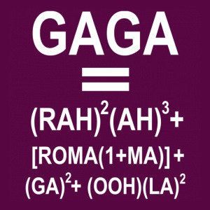
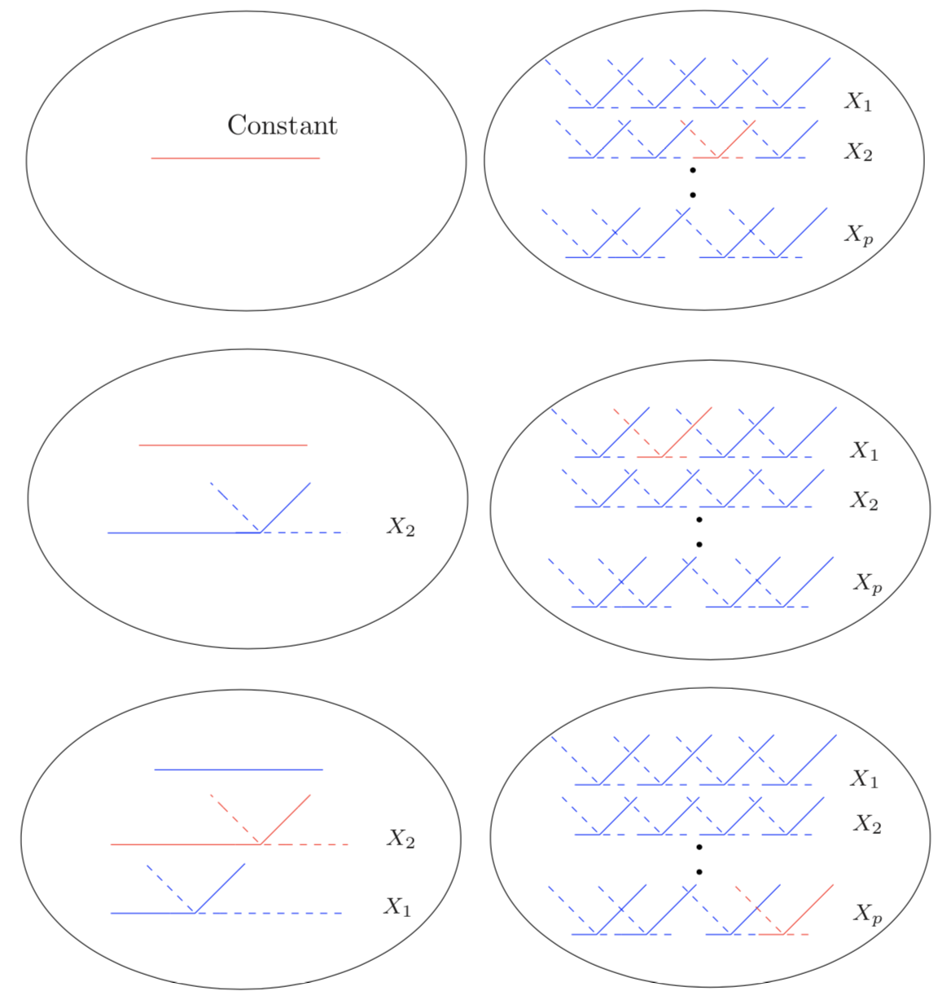
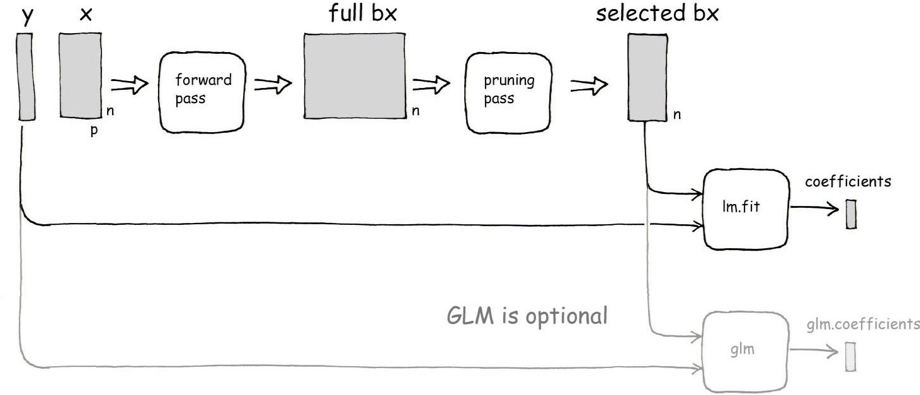
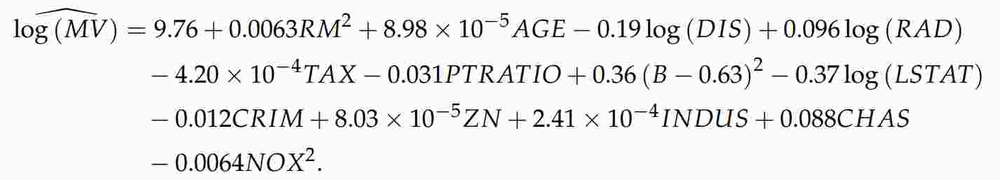
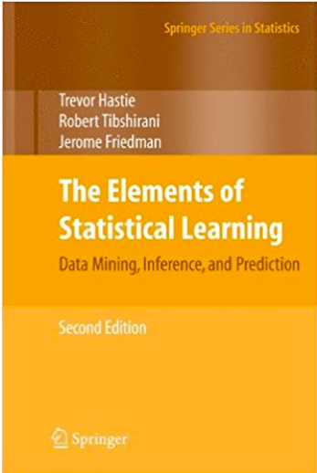

class: center, middle, inverse

background-image: url(https://upload.wikimedia.org/wikipedia/commons/5/56/Mars_Valles_Marineris.jpeg)
background-position: center
background-size: contain

# Introduction

???

Image credit: [Wikimedia Commons](https://commons.wikimedia.org/wiki/File:Sharingan_triple.svg)

```{r 04-setup, include=FALSE}
# Set global R options
options(htmltools.dir.version = FALSE, servr.daemon = TRUE)

# Set global knitr chunk options
knitr::opts_chunk$set(
  dev = "svg",
  fig.align = "center",
  fig.path = "Figures/04-Figures/", 
  cache = TRUE,
  error = FALSE,
  message = FALSE, 
  warning = FALSE, 
  collapse = FALSE 
)

# Load required packages
library(investr)   # for plotFit() function
library(magrittr)  # for forward pipe operator (i.e., %>%)
library(mda)       # for mars() function
library(ggplot2)   # for plotting
library(pdp)       # for partial dependence plots

# Better colors
set1 <- RColorBrewer::brewer.pal(9, "Set1")
dark2 <- RColorBrewer::brewer.pal(8, "Dark2")

# Helper function
plot_mars <- function(x, y, step = 1L, verbose = FALSE, ...) {
  fit <- mars(x, y, nk = step, prune = FALSE, ...)
  cuts <- unique(as.vector(fit$cuts)[-1L])
  if (verbose) {
    if (length(cuts) == 0) {
      message("Knot location: NA")
    } else {
      message("Knot location: ", 
              paste(round(cuts, digits = 4)), collapse = ", ")
    }
  }
  pd <- partial(fit, pred.var = "x", train = data.frame(x = x), 
                grid.resolution = 1000)
  pd %>%
    autoplot(color = "red2", size = 1.2) +
    geom_point(data = data.frame(x, y), aes(x, y)) +
    geom_vline(xintercept = cuts, linetype = "dashed") +
    theme_light() +
    labs(x = "x", y = "y")
}

# Simulate data
set.seed(1421)
x <- runif(100, min = -3, max = 3)
y <- -x^2 + rnorm(100)
simd <- data.frame(x, y)

# Possible knot locations
knots <- sort(unique(x))

# Generate list of two basis functions for a particular knot: original + mirror
h <- function(k) {
  list(
    function(x) ifelse(x < k, k - x, 0), 
    function(x) ifelse(x > k, x - k, 0)
  )
}
```


---

## Linear basis expansions

.large[

$$f_\theta\left(X\right) = \sum_{m = 1}^M \theta_m b_m\left(X\right) \\= \theta_1 b_1\left(X\right) + \theta_2 b_2\left(X\right) + \dots + \theta_M b_M\left(X\right)$$

]

--

.large[

* .magenta[Linear regression:] $b_m\left(X\right) = X_m, \quad m = 1, 2, \dots, p$

* .magenta[Single-layer feed-forward neural network:] $$b_m\left(X\right) = \frac{1}{1 + \exp\left(-X^\top \beta_k\right)}$$

* .magenta[CART:] $b_m\left(X\right) = I\left(X_m \in R_m\right)$

]


---

## Multiple linear regression

.large[

$$f\left(X\right) = \beta_0 + \beta_1 X_1 + \dots + \beta_p X_p$$

]

.pull-left[

.large[.green[Advantages]]

* Accurate if model is correct

* Interpretable for small $p$

* .green[Global] parametric modelling

* Quick computation

* Can work well even with small data sets!

* Statistical inference `r emo::ji("sunglasses")`

]

.pull-right[

.large[.red[Disadvantages:]]

* Inaccurate if model is incorrect

* Less interpretable for large $p$

* Global .red[parametric] modelling

* Limited flexibility

* Often need to compare multiple competing models

* Model assumptions need to be carefully assessed

* Blows up when $p > N$ `r emo::ji("bomb")`

]


---
class: center, middle

.larger[

Are regression equations really that interpretable?

]

```{r 04-gaga, echo=FALSE, out.width="50%"}

```


---

## MARS `r set.seed(102); emo::ji("earth")`

.large[

$$f\left(X\right) = \beta_0 + \beta_1 h_1\left(X\right) + \dots + \beta_m h_m\left(X\right)$$

]

* .large[.magenta[Flexible] regression modeling of .magenta[high dimensional data]]

.pull-left[

* .large[Automatically handles:]

  - Variable selection `r emo::ji("check")`

  - Nonlinear relationships `r emo::ji("check")`
    
  - Variable interactions `r emo::ji("check")`
    
  - Variable importance `r emo::ji("check")`

]

.pull-right[

```{r 04-boston-2d-pdp, echo=FALSE, fig.width=5, fig.height=4, out.width="100%"}
fit <- earth(cmedv ~ ., data = boston, degree = 2)
pd <- partial(fit, pred.var = c("rm", "nox"), chull = TRUE)
autoplot(pd)
```

]


---

## MARS basis functions

.large[

* MARS uses expansions in .red[*piecewise linear basis functions*] of the form

$$\left(x - t\right)_+ = \begin{cases} x - t, & \quad x > t\\ 0, & \quad \text{otherwise} \end{cases}$$

.center[and it's mirror]

$$\left(t - x\right)_+ = \begin{cases} t - x, & \quad x < t\\ 0, & \quad \text{otherwise} \end{cases}$$
* These functions are piecewise linear, with a .red[*knot*] at the value of *t* (i.e., they look like hockey crossing sticks `r set.seed(107); emo::ji("hockey")`)

]


---
class: center, middle

```{r 04-basis-pair, echo=FALSE, fig.width=7, fig.height=5, out.width="100%"}
# Plot basis pair
xx <- 0:100/100
yy1 <- h(0.5)[[1L]](xx)
yy2 <- h(0.5)[[2L]](xx)
plot(xx, yy1, type = "l", lwd = 3, col = dark2[1L],
     xlab = "x", ylab = "Basis function", las = 1)
lines(xx, yy2, lwd = 3, col = dark2[2L])
abline(v = 0.5, lty = 2)
text(0.1, 0.2, label = expression((t-x)["+"]), cex = 2, col = dark2[1L])
text(0.9, 0.2, label = expression((x-t)["+"]), cex = 2, col = dark2[2L])
mtext(expression(t), side = 1, cex = 1)
```


---
class: center, middle

```{r 04-basis-pair-example, echo=FALSE, fig.width=7, fig.height=5, out.width="100%"}
# Plot basis pair
xx <- 0:100/100
yy1 <- -2 * h(0.5)[[1L]](xx)
yy2 <- 0.25 * h(0.5)[[2L]](xx)
plot(c(xx, xx), c(yy1, yy2), type = "n", 
     xlab = "x", ylab = "Basis function", las = 1)
lines(xx[yy1 != 0], yy1[yy1 != 0], type = "l", lwd = 3, col = dark2[1L])
lines(xx[yy2 != 0], yy2[yy2 != 0], lwd = 3, col = dark2[2L])
abline(v = 0.5, lty = 2)
text(0.775, -0.4, label = expression(f(x) == -2(t-x)["+"] + 0.25(x-t)["+"]), cex = 1.2)

```


---

## MARS basis function pool

.large[

* A basis function pair is constructed for each feature $X_j$, with knots at each unique value $x_{ij}$

* In total, there are $2Np$ possible piecewise linear basis functions available for inclusion in the model

$$C = \left\{\left(X_j - x_{ij}\right)_+, \left(x_{ij} - X_j\right)_+\right\}\\i = 1, \dots, N\\j = 1, \dots, p$$

* The basis functions used in MARS are elements of *C* (.red[main effects]), or built up from products thereof (.red[interactions])!

]


---

## The basic idea

.large[

* MARS builds a model in two steps:

  - A .darkorange[*forward pass*] where pairs of basis functions (from $C$) are added in a greedy fashion (i.e., [forward selection](https://en.wikipedia.org/wiki/Stepwise_regression))
    
  - A .darkorange[*backward pass*] where the least important terms are dropped from the model one at a time (i.e., [backward elimination](https://en.wikipedia.org/wiki/Stepwise_regression))
    
* In the end, .red[an ordinary linear model is fit using *least squares* to the selected basis functions]

.center[however...]

]


---
class: center, middle, inverse

background-image: url(Images/mars-pvalues.jpg)
background-position: center
background-size: contain

???

Image credit: [imgflip](https://imgflip.com/)


---
class: center, middle

# Why?


---
class: center, middle

.large[

Traditional stepwise procedures are often applied incorrectly!!

]

```{r 04-standard-errors, echo=FALSE, out.width="70%"}

```


---

## MARS: forward pass

.large[

* Analagous to [*forward selection*](https://en.wikipedia.org/wiki/Stepwise_regression)

* Start with a simple intercept only model: $f\left(X\right) = \beta_0 = \bar{y}$

* Search for variable + knot combination that gives the greatest improvement to the current model

   - This requires trying all (mirror) pairs of basis functions
   
   - Improvement is measured using RMSE
   
   - Continue until largest model is reached (.darkorange[tuning parameter])
   
]


---
class: center, middle, inverse

```{r 04-mars-basis-pool, echo=FALSE, out.width="75%"}

```

???

Image credit: [The Elements of Statistical Learning (Figure 9.10)](https://web.stanford.edu/~hastie/ElemStatLearn/)


---

## MARS: forward pass

```{r 04-splines-1, echo=FALSE, fig.width=5, fig.height=5, out.width="60%"}
library(ggplot2)
ggplot(data.frame(x, y), aes(x, y)) +
  geom_point() +
  theme_light() +
  ggtitle("Simulated quadratic data")
```


---

## MARS: forward pass

```{r 04-splines-2, echo=FALSE, fig.width=5, fig.height=5, out.width="60%"}
plot_mars_step(x, y, step = 1) + ggtitle("Single region")
```


---

## MARS: forward pass

```{r 04-splines-3, echo=FALSE, fig.width=5, fig.height=5, out.width="60%"}
plot_mars_step(x, y, step = 3) + ggtitle("Two regions")
```


---

## MARS: forward pass

```{r 04-splines-4, echo=FALSE, fig.width=5, fig.height=5, out.width="60%"}
plot_mars_step(x, y, step = 5) + ggtitle("Three regions")
```


---

## MARS: forward pass

```{r 04-splines-5, echo=FALSE, fig.width=5, fig.height=5, out.width="60%"}
plot_mars_step(x, y, step = 7) + ggtitle("Four regions")
```


---

## MARS: forward pass

```{r 04-splines-6, echo=FALSE, fig.width=5, fig.height=5, out.width="60%"}
plot_mars_step(x, y, step = 9) + ggtitle("Five regions (overfitting?)")
```


---
class: center, middle, inverse

background-image: url(Images/another-one.jpg)


---

## MARS: forward pass

```{r 04-splines-7, echo=FALSE, fig.width=5, fig.height=5, out.width="60%"}
plot_mars_step(x, y, step = 11) + ggtitle("Six regions (overfitting?)")
```


---
class: center, middle

.huger[Let's do it manually!]

```{r, echo=FALSE, out.width="50%"}

```


---

## MARS: backward pass

.large[

* Analagous to [*backward elimination*](https://en.wikipedia.org/wiki/Stepwise_regression)

* After the maximimal model is obtained from the forward pass, switch to backward elimination

  - Remove basis functions .red[one at a time] (whichever one results in the smallest increase in RMSE)
    
  - MARS uses .darkorange[*generalized cross-validation*] (GCV) to suggest when to stop removing terms
  
  - This can be overridden by the user during training (e.g., *k*-fold cross-validation can be used instead)

]


---

## Final (pruned) MARS model

```{r 04-splines-8, echo=FALSE, fig.width=5, fig.height=5, out.width="60%"}
plot_mars_step(x, y, step = 7) + ggtitle("Four regions")
```


---

## Generalized cross-validation

* .medium[GCV is an approximate form of .magenta[*leave-one-out cross-validation*] that]

  - .medium[Allows for .red[computationally efficient] model selection]
    
  - .medium[Provides more .red[honest model performance metrics] (e.g., *R*-squared for regression)]
    
  - .medium[Provides results that are consistent with ordinary $k$-fold cross-validation]

* .medium[When MARS selects terms to go into the model (forward pass) or removes terms (backward pass), the selection is typically made using the GCV results]

* .medium[For example, when MARS removes a term during the backward pass, it removes the term that gives the smallest increase in GCV error]


---

## Variable importance

.large[

* MARS can construct an internal measure of variable importance:

  - Calculate the decrease in RMSE for each subset relative to the previous subset during the backward pass

  - For each variable, sum these decreases over all subsets that include the variable

  - For ease of interpretation, the summed decreases are scaled so the largest is 100

]


---

## MARS vs. PPR and NNs

.scrollable[

.pull-left[

* PPR and NNs are .red[*universal approximators*]; however, this generality comes at a price

    - More difficult to interpret
    
    - Longer training times 
    
    - Model tuning is an art
    
* MARS offers a nice compromise!

    - Competitive predictive performance

    - Easier to interpret
    
    - Faster training times
    
    - Incredibly easy to tune
    
    - **Much easier to productionize!!**
    
    - Can naturally handle many types of response variables (not just Gaussian)

]

.pull-right[

```{r waiting, echo=FALSE, out.wdith="70%"}

```

]

]

???

Image credit: [imgflip](https://imgflip.com/meme/Waiting-Skeleton)


---
class: center, middle

background-image: url(Images/esl-tab.png)

???

Image credit: [The Elements of Statistical Learning (Figure 10.1)](https://web.stanford.edu/~hastie/ElemStatLearn/)


---
class: center, middle, inverse

# Fitting MARS models in R


---

## R packages

.pull-left[

## [`mda`](https://cran.r-project.org/package=mda)

* **m**ixture **d**iscriminant **a**nalysis

* Lightweight function `mars()`
    
* Gives quite similar results to Friedman's original FORTRAN program

* No formula method

]

.pull-right[

## [`earth`](http://www.milbo.users.sonic.net/earth/) `r emo::ji("earth_americas")`

* **e**nhanced **a**daptive **r**egression **t**hrough **h**inges

* Derived from `mda::mars()`
    
* Support for GLMs (e.g., logistic regression)
    
* More bells and whistles than `mda::mars()`; for example,

    - Variable importance scores
    
    - Support for $k$-fold cross-validation)
    
]


---
class: center, middle

```{r 04-earth-diagram, echo=FALSE, out.width="100%", fig.cap="Source: earth package vignette by Stephen Milborrow."}

```


---

## Boston housing example

```{r 04-earth-install, eval=FALSE}
# Install required packages
install.packages("earth")
```

```{r 04-mars-boston-setup}
# Modelling
library(earth)    # for fitting MARS models

# Visualization and model insights
library(ggplot2)  # for autoplot() function
library(pdp)      # for partial dependence plots
library(vip)      # for variable importance plots

# Boston housing data
data(boston, package = "pdp")
```


---

```{r boston-pairs, echo=TRUE, out.width = "70%"}
pairs(boston[c("cmedv", "lstat", "rm", "age", "lon", "lat")],
      col = adjustcolor("purple2", alpha.f = 0.5))
```


---
class: center, middle 

.larger[Harrison and Rubinfeld's original housing value equation:]

</br>

```{r, echo=FALSE, out.width="100%"}

```


---

## Boston housing example

.scrollable[

```{r 04-mars-boston-fit}
# Fit a second-degree MARS model
boston_mars <- earth(
  cmedv ~ .,  #<<
  data = boston,
  degree = 2  # tuning parameter #<<
)

# Print model summary
print(boston_mars)
```

]


---

## Boston housing example

.scrollable[

```{r 04-mars-boston-fit-detail}
# Print detailed model summary
summary(boston_mars)
```

]


---

## Boston housing example

```{r 04-mars-boston-plot, out.width="50%"}
# Plot model summary
plot(boston_mars)
```


---

## Boston housing example

.pull-left[

Variable importance for MARS models based on GCV results:

```{r 04-mars-boston-vip-code, eval=FALSE}
# Variable importance plot
vip(
  boston_mars, 
  num_features = 15 #<<
)
```

]

.pull-right[

```{r 04-mars-boston-vip-plot, echo=FALSE, fig.width=5, fig.height=6}
# Load required packages
library(vip)

# Variable importance plot
vip(boston_mars, num_features = 15)
```

]


---

## Boston housing example

```{r 04-mars-boston-pdp-code, eval=FALSE}
# Partial dependence of cmedv on rm
p1 <- boston_mars %>%
  partial(pred.var = "rm") %>%
  autoplot(color = "red2", size = 1) +
  geom_point(data = boston, aes(x = rm, y = cmedv), alpha = 0.1) +
  theme_light()

# Partial dependence of cmedv on lstat
p2 <- boston_mars %>%
  partial(pred.var = "lstat") %>%
  autoplot(color = "red2", size = 1) +
  geom_point(data = boston, aes(x = lstat, y = cmedv), alpha = 0.1) +
  theme_light()

# Partial dependence of cmedv on rm and lstat
p3 <- boston_mars %>%
  partial(pred.var = c("rm", "lstat"), chull = TRUE) %>%  #<<
  autoplot() +
  theme_light()

# Display plots side-by-side
grid.arrange(p1, p2, p3, ncol = 3)
```


---

class: center, middle

```{r 04-mars-boston-pdp-plot, echo=FALSE, fig.wdith=12, fig.height=3, out.width="100%"}
# Partial dependence of cmedv on rm
p1 <- boston_mars %>%
  partial(pred.var = "rm") %>%
  autoplot(color = "red2", size = 1) +
  geom_point(data = boston, aes(x = rm, y = cmedv), alpha = 0.1) +
  theme_light()

# Partial dependence of cmedv on lstat
p2 <- boston_mars %>%
  partial(pred.var = "lstat") %>%
  autoplot(color = "red2", size = 1) +
  geom_point(data = boston, aes(x = lstat, y = cmedv), alpha = 0.1) +
  theme_light()

# Partial dependence of cmedv on rm and lstat
p3 <- boston_mars %>%
  partial(pred.var = c("rm", "lstat"), chull = TRUE) %>%
  autoplot() +
  theme_light()

# Display plots side-by-side
grid.arrange(p1, p2, p3, ncol = 3)
```


---
class: center, middle, inverse

background-image: url(Images/your-turn.jpg)
background-position: center
background-size: contain

???

Image credit: [imgflip](https://imgflip.com/)


---
class: middle

.large[

Refit the same model to the Boston housing data using .red[5-fold cross-validation], rather than the standard GCV statistic

(**Hint:** specify `pmethod = "cv"` and `nfold = 5` in the call to `earth()`)

  1. Do the results seem to differ much?

  2. Do the residual plots indicate any serious problems?
  
  3. Construct a PDP for the top predictor

]


---
class: middle

.scrollable[

```{r 04-your-turn-01-solution-01, echo=TRUE}
# Fit a second-degree MARS model to the Boston housing data using 
# (repeated) 5-fold cross-validation
set.seed(1419)  # for reproducibiity  #<<
boston_mars_cv <- earth(
  cmedv ~ ., 
  data = boston, 
  degree = 2,
  pmethod = "cv",  #<<
  nfold = 5,       #<<
  ncross = 3       #<<
)
```

]


---
class: middle 

.scrollable[

```{r 04-your-turn-01-solution-02, echo=TRUE}
# Print detailed model summary
summary(boston_mars_cv)
```

]


---
class: middle 

.scrollable[

```{r 04-your-turn-01-solution-03, echo=TRUE}
# Residual plots, etc.
plot(boston_mars_cv)
```

]


---
class: middle 

.scrollable[

.pull-left[

```{r 04-your-turn-01-solution-04, echo=TRUE}
# Variable importance plot
vi(boston_mars_cv)
```

]

.pull-right[

```{r 04-your-turn-01-solution-05, echo=TRUE, out.width="80%"}
# Partial dependence plot
partial(boston_mars_cv, 
  pred.var = "rm", 
  plot = TRUE, rug = TRUE  #<<
)
```

]

]


---
class: center, middle, inverse

background-image: url(Images/tuning.jpg)

# Model tuning

???

Image credit: [imgflip](http://www.learntoplaymusic.com/blog/tune-guitar/)


---

## Tuning parameters

.large[

* MARS really only has two tuning parameters:

    - The maximum degree of interaction
  
    - The maximum number of terms in the pruned model (including the intercept)

```{r 04-mars-earth-getModelInfo}
caret::getModelInfo("earth")$earth$parameters
```

]


---

## Boston housing example

```{r 04-mars-boston-caret}
# Load required packages
library(caret)

# Tune a MARS model
set.seed(1512)  # for reprocubility
boston_mars_tune <- train(
  x = subset(boston, select = -cmedv),
  y = boston$cmedv,
  method = "earth",
  metric = "Rsquared",
  trControl = trainControl(method = "repeatedcv", 
                           number = 5, repeats = 3),
  tuneGrid = expand.grid(degree = 1:5, nprune = 100)
)
```


---

## Boston housing example

.scrollable[

```{r 04-mars-boston-caret-results}
# Print model tuning summary
print(boston_mars_tune)
```

]


---
class: middle 

.scrollable[

```{r 04-mars-boston-caret-results-plot, fig.width=7, fig.height=5, out.width="60%"}
# Plot model tuning summary
ggplot(boston_mars_tune) + theme_light()
```

]


---

## Boston housing example

.scrollable[

```{r 04-mars-boston-caret-final}
# Print model summary (for final model)
summary(boston_mars_tune$finalModel)
```

]


---

## Boston housing example

.pull-left[

```{r 04-mars-boston-caret-vip-code, eval=FALSE}
# Variable importance plot
vip(
  boston_mars_tune, 
  num_features = 15  #<<
)  
```

]

.pull-right[

```{r 04-mars-boston-caret-vip-plot, echo=FALSE, fig.width=5, fig.height=6}
# Variable importance plot
vip(boston_mars_tune, num_features = 15)  
```

]


---

## Boston housing example

.pull-left[

```{r 04-mars-boston-caret-pdp-code, eval=FALSE}
# Partial dependence of cmedv 
# on both rm and nox
pd <- partial(
  boston_mars_tune, 
  pred.var = c("rm", "nox"),
  chull = TRUE
)

# Interactive 3-D plot
plotly::plot_ly(
  x = ~rm, 
  y = ~nox, 
  z = ~yhat, 
  data = pd,
  type = "mesh3d"
)
```

]

.pull-right[

```{r 04-mars-boston-caret-pdp-plot, echo=FALSE, out.width="100%"}
# Partial dependence of cmedv 
# on both rm and nox
pd <- partial(
  boston_mars_tune, 
  pred.var = c("rm", "nox"),
  chull = TRUE
)

# Interactive 3-D plot
plotly::plot_ly(
  x = ~rm, 
  y = ~nox, 
  z = ~yhat, 
  data = pd,
  type = "mesh3d"#,
  # intensity = range(pd$yhat),
  # # color = range(pd$yhat),
  # colors = viridis::viridis(n = 10)
)
```

]


---
class: center, middle, inverse

background-image: url(Images/your-turn.jpg)
background-position: center
background-size: contain

???

Image credit: [imgflip](https://imgflip.com/)


---
class: middle

.large[

Retune the previous MARS model using .red[*repeated 10-fold cross-validation*]. Do the results seem to differ much from those obtained previously using repeated 5-fold cross-validation?

(**Hint:** this can be done using `trainControl(method = "repeatedcv", number = 10, repeats = 3)` in the call to `train()`)

]


---
class: middle

.scrollable[

```{r 04-mars-boston-caret-2, eval=FALSE}
# Tune a MARS model
set.seed(2045)  # for reprocubility
boston_mars <- train(
  x = subset(boston, select = -cmedv),
  y = boston$cmedv,
  method = "earth",
  metric = "Rsquared",
  trControl =  trainControl(method = "repeatedcv", 
                            number = 10, repeats = 3),
  tuneGrid = expand.grid(degree = 1:5, nprune = 50)
)

# Visualize results
ggplot(boston_mars) +
  theme_light()
```

]


---
class: middle

```{r 04-mars-boston-caret-3, echo=FALSE, fig.width=7, fig.height=5, out.width="80%"}
# Tune a MARS model
set.seed(2045)  # for reprocubility
boston_mars <- train(
  x = subset(boston, select = -cmedv),
  y = boston$cmedv,
  method = "earth",
  metric = "Rsquared",
  trControl =  trainControl(method = "repeatedcv", 
                            number = 10, repeats = 3),
  tuneGrid = expand.grid(degree = 1:4, nprune = 50)
)

# Visualize results
ggplot(boston_mars) +
  theme_light()
```


---

## Additional resources

.pull-left[

```{r 08-svm-books, echo=FALSE, out.width="80%"}

```

]

.pull-right[

.large[

* [Martian Chronicles: Is MARS better than Neural Networks?](http://citeseerx.ist.psu.edu/viewdoc/summary?doi=10.1.1.375.9523)

* [Friedman's original paper](https://projecteuclid.org/euclid.aos/1176347963)

* [Friedman's follow-up paper (technical report)](https://statistics.stanford.edu/research/fast-mars)

* [Salford System's training videos](https://www.salford-systems.com/products/mars#videos)

]

]


---

## Questions?

```{r 04-chuck-mars, echo=FALSE, out.width="80%"}

```

