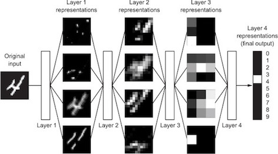
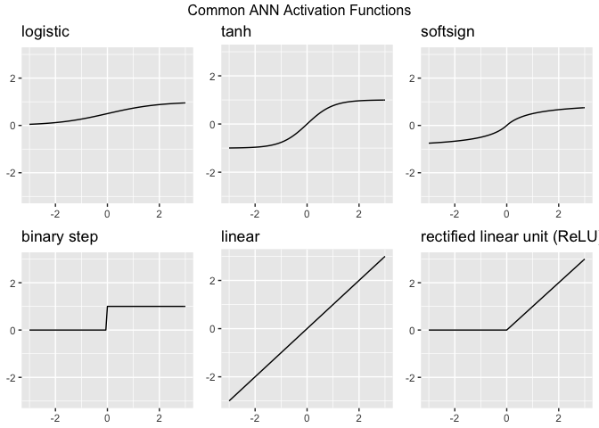

class: center, middle, inverse

background-image: url(https://mir-s3-cdn-cf.behance.net/project_modules/disp/b2ac1a19467255.562dae98a2b23.jpg)
background-size: cover

# Deep Learning

???

Image credit: [Behance](https://www.behance.net/gallery/19467255/Thinking-David-))

```{r 04-setup, include=FALSE}
# Set global R options
options(htmltools.dir.version = FALSE, servr.daemon = TRUE)

# Set global knitr chunk options
knitr::opts_chunk$set(
  dev = "svg",
  fig.align = "center",
  fig.path = "Figures/05-Figures/",  # change 00 to chapter number!
  cache = TRUE,
  error = FALSE,
  message = FALSE, 
  warning = FALSE, 
  collapse = TRUE 
)
```


---

## Why deep learning?

Neural networks originated in the computer science field to answer questions that normal statistical approaches were not designed to answer.

```{r, echo=FALSE}

```


.full-width[.content-box-blue[.bolder[.center[
We humans interpret the many features of each digit (i.e. angles, edges, thickness, circles). `r emo::ji("thinking_face")`
]]]]


---

## Why deep learning?

In essence, neural networks perform the same task albeit in a far simpler manner than our brains

```{r, echo=FALSE, out.height="65%", out.width="65%"}

```


.full-width[.content-box-blue[.bolder[.center[
But the computational demands were a barrier.  `r emo::ji("stop_sign")`
]]]]


---

## Overcoming challenges

Recent advancements have created new energy around neural networks:

* advancements in computer hardware (off the shelf CPUs became faster and GPUs were created) made computation more practical,

* growth in data collection made them more relevant,

* advancements in the underlying algorithms made the depth (number of hidden layers) of neural nets less of a constraint

<br>

```{r, echo=FALSE}

```

---

## The result...

Deeper, more complex neural networks

.green[__Pros:__]

* high-dimensional, unstructured feature-rich data

* automates feature engineering

* complex, non-linear relationships

.red[__Cons:__]

* computationally demanding

* _as feature dimension space reduces, traditional machine learning approaches tend to perform just as well, if not better, and are more efficient_


.full-width[.content-box-blue[.bolder[.center[
`r emo::ji("warning")` DNNs are not a panacea!
]]]]


---

## Feedforward DNNs

Multiple DNN models exist:

* __convolutional neural networks__ (CNN or ConvNet) have wide applications in image and video recognition,

* __recurrent neural networks__ (RNN) are used with speech recognition,

* __long short-term memory neural networks__ (LTSM) are advancing automated robotics and machine translation.

Fundamental to all these methods is the ___feedforward neural net___ (aka multilayer perceptron)

```{r, echo=FALSE}
knitr::include_graphics("Images/mlp_network.png")
```


---

## Key components

To build a feedforward DNN we need 4 key components:

1. input data,

2. a defined network architecture,

3. a feedback mechanism to help our model learn,

4. a model training approach.

<br>

```{r, echo=FALSE}

```

---

class: center, middle, inverse

background-image: url(Images/prerequisites.png)
background-position: center
background-size: contain

---

## Package requirement

We'll use the CPU-based version of `keras` and `TensorFlow`

Install with the following:

```{r, eval=FALSE}
install.packages("keras")
keras::install_keras()

# will require you to execute the following at a terminal
$ sudo /usr/bin/easy_install pip
$ sudo /usr/local/bin/pip install --upgrade virtualenv

# if you get the above notification you will need to re-run
keras::install_keras()
```

```{r load_keras}
library(keras)
```

.full-width[.content-box-blue[.bolder[.center[
See [keras.rstudio.com](keras.rstudio.com) for details.
]]]]

---

## Data requirement

.scrollable[

1. Feedfoward DNNs require all feature inputs to be numeric. Consequently, we one-hot encode with `model.matrix`.
2. Due to the data transformation process that DNNs perform, they are highly sensitive to the individual scale of the feature values. Consequently, we standardize our feature sets. Also note, that we are standardizing our test feature sets based on the mean and standard deviation of the training features to minimize data leakage.
3. When one-hot encoding, some variable levels have little or no variance. We remove these variables.


```{r data_prep}
# one hot encode --> we use model.matrix(...)[, -1] to discard the intercept
data_onehot <- model.matrix(~ ., AmesHousing::make_ames())[, -1] %>% as.data.frame()

# Create training (70%) and test (30%) sets for the AmesHousing::make_ames() data.
# Use set.seed for reproducibility
set.seed(123)
split <- rsample::initial_split(data_onehot, prop = .7, strata = "Sale_Price")
train <- rsample::training(split)
test  <- rsample::testing(split)

# Create & standardize feature sets
# training features
train_x <- train %>% dplyr::select(-Sale_Price)
mean    <- colMeans(train_x)
std     <- apply(train_x, 2, sd)
train_x <- scale(train_x, center = mean, scale = std)

# testing features
test_x <- test %>% dplyr::select(-Sale_Price)
test_x <- scale(test_x, center = mean, scale = std)

# Create & transform response sets
train_y <- log(train$Sale_Price)
test_y  <- log(test$Sale_Price)

# zero variance variables (after one hot encoded) cause NaN so we need to remove
zv <- which(colSums(is.na(train_x)) > 0, useNames = FALSE)
train_x <- train_x[, -zv]
test_x  <- test_x[, -zv]

# check dimensions
dim(train_x)
dim(test_x)
```

]

---

class: center, middle, inverse

background-image: url(http://video.epfl.ch/EPFLTV//Images/Channel/LogoSAR.png)

# Network Architecture

???

Image credit: [EPFLTV](http://video.epfl.ch/EPFLTV//Images/Channel/LogoSAR.png)

---

## Layers & nodes

Building blocks of your model and they decide how complex the network will be

* Layers are considered dense (fully connected) where all the nodes in each successive layer are connected

* More layers and nodes you add the more opportunities for new features to be learned (commonly referred to as the model’s capacity)

* Beyond the input layer, which is just our predictor variables:
  - hidden layers
     - no well-defined rules to follow for #
     - rectangular data $\rightarrow$ 2-5 layers are sufficient
     - number of hidden layers and nodes in your network will drive the computational burden of your model
  - output layer
     - driven by the type of modeling you are performing
     - Regression $\rightarrow$ 1 node
     - Binary classification $\rightarrow$ 1 node $\rightarrow$ probability of success
     - Multinomial $\rightarrow$ $y_n$ nodes $\rightarrow$ probability of each class
     
---

## Implementation

`keras` uses a layering approach with `%>%`

* Two hidden layers
  - $1^{st}$: 10 nodes
  - $2^{nd}$: 5 nodes

```{r, eval=FALSE}
model <- keras_model_sequential() %>%
  layer_dense(units = 10, input_shape = ncol(train_x)) %>%  # hidden layer 1
  layer_dense(units = 5) %>%                                # hidden layer 2
  layer_dense(units = 1)                                    # output layer
```


<br><br>

.full-width[.content-box-blue[.bolder[.center[
Note: must tell first hidden layer how many features to expect with `input_shape`!
]]]]


---

## Activation functions

__Human body__

* biologic neurons receive inputs from many adjacent neurons

* when these inputs accumulate beyond a certain threshold the neuron is ___activated___ suggesting there is a signal

__Neural nets__

* we use activation functions to perform the same thing in neural nets

```{r, echo=FALSE}
knitr::include_graphics("Images/perceptron_node.png")
```

---

## Activation functions

Multiple activations to choose from:

```{r, echo=FALSE, out.height="60%", out.width="60%"}

```


.full-width[.content-box-blue[.bolder[.center[
[https://en.wikipedia.org/wiki/Activation_function](https://en.wikipedia.org/wiki/Activation_function)
]]]]

---

## Activation functions


Rule of  `r emo::ji("thumbs up")`:

__Hidden layers__

* Rectified linear unit (ReLU) most popular

* Sigmoid

* TanH

__Output layers__

* Regression: linear (identity)

* Binary Classification: Sigmoid

* Multinomial: Softmax

---

## Implementation

We specify activation with...wait for it...`activation`

```{r, eval=FALSE}
model <- keras_model_sequential() %>%
  layer_dense(units = 10, activation = "relu", input_shape = ncol(train_x)) %>%
  layer_dense(units = 5, activation = "relu") %>%
  layer_dense(units = 1)
```

---

class: center, middle, inverse

background-image: url(Images/sgd_icon.gif)
background-position: center
background-size: contain

# Backpropagation

---

## Mini-batch stochastic gradient descent

The primary ___learning___ mechanism in neural networks

  Step 1: sample observations (*mini-batch*)

  Step 2: assign weights and perform *forward pass*

  Step 3: compute *loss function*

  Step 4: work backwards through each layer, compute *partial derivatives*

  Step 5: adjust weights a little in the opposite direction of the gradient (*learning rate*)

  Step 6: grab another mini-batch, rinse and repeate until loss function is minimized

<br>

.full-width[.content-box-blue[.bolder[.center[
There are many mini-batch SGD algorithms to choose from.
]]]]


---

## Implementation

To be able to perform backpropagation we need to add a `compile` layer to our model where we specify:

* mini-batch SGD algorithm (i.e. `rmsprop` (default),  `adadelt`, `adam`)

* loss metric (regression: MSE, MAE, MAPE; classification: binary/categorical crossentropy)

* additional metrics to track

```{r, eval=FALSE}
model <- keras_model_sequential() %>%
  layer_dense(units = 10, activation = "relu", input_shape = ncol(train_x)) %>%
  layer_dense(units = 5, activation = "relu") %>%
  layer_dense(units = 1) %>%
  compile(                      #<<
    optimizer = "rmsprop",      #<<
    loss      = "mse",          #<<
    metrics   = c("mae","mape") #<<
  )                             #<<
```

<center>
<bold>
<font color="red">
We're finally ready to train! `r emo::ji("person running")` 
</font>
</bold>
</center>

---

class: center, middle, inverse

background-image: url(Images/training_icon.jpg)
background-size: cover

# Model Training

---

## Model Training

To train a model, we use `fit`

* `batch_size`: anywhere from 1-*n* $\rightarrow$ typically 32, 64, 128, 256

* `epochs`: 1 epoch equals *n* forward passes with specified batch size to go through all sample data

* `validation_split`: data set aside for out-of-sample error estimate


```{r, eval=FALSE}
learn <- model %>% fit(
  x = train_x,
  y = train_y,
  batch_size = 32,
  epochs = 25,
  validation_split = .2,
  verbose = FALSE
)
```

.full-width[.content-box-yellow[.bolder[.center[
Let's put it all together! 
]]]]


---

## Putting it all together

.scrollable[

```{r train}
model <- keras_model_sequential() %>%
  
  # network architecture
  layer_dense(units = 10, activation = "relu", input_shape = ncol(train_x)) %>%
  layer_dense(units = 5, activation = "relu") %>%
  layer_dense(units = 1) %>%
  
  # backpropagation
  compile(
    optimizer = "rmsprop",
    loss = "mse",
    metrics = c("mae", "mape")
  )

# train our model
learn <- model %>% fit(
  x = train_x,
  y = train_y,
  epochs = 25,
  batch_size = 32,
  validation_split = .2,
  verbose = FALSE
)

learn

plot(learn)
```

]

---

class: center, middle, inverse

background-image: url(Images/tuning-your-guitar.jpg)
background-size: cover

# Tuning

---

## General tuning process

* ___Many___ ways to tune a DNN

* Typically, the tuning process follows these general steps; however, there is often a lot of iteration among these:

   1. Adjust model capacity (layers & nodes)
   2. Increase epochs if you do not see a flatlined loss function
   3. Add batch normalization
   4. Add dropout
   5. Add weight regularization
   6. Adjust learning rate

---

## Adjust model capacity (layers & nodes)

.scrollable[

Purposely overfit, then reduce layers/nodes until errors stabilize


```{r overfit}
model <- keras_model_sequential() %>%
  
  # network architecture
  layer_dense(units = 500, activation = "relu", input_shape = ncol(train_x)) %>% #<<
  layer_dense(units = 250, activation = "relu") %>% #<<
  layer_dense(units = 125, activation = "relu") %>% #<<
  layer_dense(units = 1) %>%
  
  # backpropagation
  compile(
    optimizer = "rmsprop",
    loss = "mse",
    metrics = c("mae", "mape")
  )

# train our model
learn <- model %>% fit(
  x = train_x,
  y = train_y,
  epochs = 25,
  batch_size = 32,
  validation_split = .2,
  verbose = FALSE
)

plot(learn)
```


]

---

class: center, middle, inverse

background-image: url(http://amsterdammakerfestival.nl/wp-content/uploads/2016/08/the-challenge.png)


---

## Your Turn!

Reduce the layers and nodes until you find stable errors.

---

## Solution

.scrollable[

```{r dnn_solution1}
model <- keras_model_sequential() %>%
  
  # network architecture
  layer_dense(units = 100, activation = "relu", input_shape = ncol(train_x)) %>% #<<
  layer_dense(units = 50, activation = "relu") %>% #<<
  layer_dense(units = 1) %>%
  
  # backpropagation
  compile(
    optimizer = "rmsprop",
    loss = "mse",
    metrics = c("mae", "mape")
  )

# train our model
learn <- model %>% fit(
  x = train_x,
  y = train_y,
  epochs = 25,
  batch_size = 32,
  validation_split = .2,
  verbose = FALSE
)

learn

plot(learn)
```

]

---

## Adjust epochs

.scrollable[

* If you notice your loss function is still decreasing in the last epoch then you will want to increase the number of epochs. 

* Alternatively, if your epochs flatline early then there is no reason to run so many epochs as you are just using extra computational energy with no gain. 

* We can add a `callback` function inside of fit to help with this.

```{r epochs}
# train our model
learn <- model %>% fit(
  x = train_x,
  y = train_y,
  epochs = 25,
  batch_size = 32,
  validation_split = .2,
  verbose = FALSE,
  callbacks = list(  #<<
    callback_early_stopping(patience = 2) #<<
  ) #<<
)

learn

plot(learn)
```

]

---

## Add batch normalization

.scrollable[

As we add more layers, it becomes important that we continue to renormalize to help with gradient propogation.

```{r batch_renorm}
model <- keras_model_sequential() %>%
  
  # network architecture
  layer_dense(units = 100, activation = "relu", input_shape = ncol(train_x)) %>%
  layer_batch_normalization() %>% #<<
  layer_dense(units = 50, activation = "relu") %>%
  layer_batch_normalization() %>% #<<
  layer_dense(units = 1) %>%
  
  # backpropagation
  compile(
    optimizer = "rmsprop",
    loss = "mse",
    metrics = c("mae", "mape")
  )

# train our model
learn <- model %>% fit(
  x = train_x,
  y = train_y,
  epochs = 25,
  batch_size = 32,
  validation_split = .2,
  verbose = FALSE,
  callbacks = list(  
    callback_early_stopping(patience = 2) 
  ) 
)

learn

plot(learn)
```

]

---

## Add dropout

.scrollable[

* ___Dropout___ is one of the most effective and commonly used approaches to prevent overfitting in neural networks. 

* Dropout randomly drops out (setting to zero) a number of output features in a layer during training. 

* By randomly removing different nodes, we help prevent the model from fitting patterns to happenstance patterns (noise) that are not significant.

```{r dropout}
model <- keras_model_sequential() %>%
  
  # network architecture
  layer_dense(units = 100, activation = "relu", input_shape = ncol(train_x)) %>%
  layer_batch_normalization() %>%
  layer_dropout(rate = 0.2) %>% #<<
  layer_dense(units = 50, activation = "relu") %>%
  layer_batch_normalization() %>%
  layer_dropout(rate = 0.2) %>% #<<
  layer_dense(units = 1) %>%
  
  # backpropagation
  compile(
    optimizer = "rmsprop",
    loss = "mse",
    metrics = c("mae", "mape")
  )

# train our model
learn <- model %>% fit(
  x = train_x,
  y = train_y,
  epochs = 25,
  batch_size = 32,
  validation_split = .2,
  verbose = FALSE,
  callbacks = list(  
    callback_early_stopping(patience = 2) 
  ) 
)


learn

plot(learn)
```


]

---

## Add weight regularization

.scrollable[

We can add regularization just as we saw in earlier tutorial:

* $L_2$ *norm*: most common $\rightarrow$ ridge $\rightarrow$ called ___weight decay___ in the context of neural nets

* $L_1$ *norm*: lasso

* Combination: elastic net

```{r dnn_regularize}
model <- keras_model_sequential() %>%
  
  # network architecture
  layer_dense(units = 100, activation = "relu", input_shape = ncol(train_x),
              kernel_regularizer = regularizer_l2(0.001)) %>% #<<
  layer_batch_normalization() %>%
  layer_dense(units = 50, activation = "relu",
              kernel_regularizer = regularizer_l2(0.001)) %>% #<<
  layer_batch_normalization() %>%
  layer_dense(units = 1) %>%
  
  # backpropagation
  compile(
    optimizer = "rmsprop",
    loss = "mse",
    metrics = c("mae", "mape")
  )

# train our model
learn <- model %>% fit(
  x = train_x,
  y = train_y,
  epochs = 25,
  batch_size = 32,
  validation_split = .2,
  verbose = FALSE,
  callbacks = list(
    callback_early_stopping(patience = 2)
  )
)

learn

plot(learn)
```


]

---

## Adjust learning rate

* The different optimizers (i.e. RMSProp, Adam, Adagrad) have different algorithmic approaches for deciding the learning rate.

<br>

```{r, echo=FALSE}

```

---

## Adjust learning rate

.scrollable[

* The different optimizers (i.e. RMSProp, Adam, Adagrad) have different algorithmic approaches for deciding the learning rate.

* We can automatically adjust the learning rate by a factor of 2-10 once the validation loss has stopped improving.

```{r adjust_learning}
model <- keras_model_sequential() %>%
  
  # network architecture
  layer_dense(units = 100, activation = "relu", input_shape = ncol(train_x),
              kernel_regularizer = regularizer_l2(0.001)) %>% #<<
  layer_batch_normalization() %>%
  layer_dense(units = 50, activation = "relu",
              kernel_regularizer = regularizer_l2(0.001)) %>% #<<
  layer_batch_normalization() %>%
  layer_dense(units = 1) %>%
  
  # backpropagation
  compile(
    optimizer = "adadelta", #<<
    loss = "mse",
    metrics = c("mae", "mape")
  )

# train our model
learn <- model %>% fit(
  x = train_x,
  y = train_y,
  epochs = 25,
  batch_size = 32,
  validation_split = .2,
  verbose = FALSE,
  callbacks = list(
    callback_early_stopping(patience = 2),
    callback_reduce_lr_on_plateau() #<<
  )
)

learn

plot(learn)
```


]

---


class: center, middle, inverse

background-image: url(http://amsterdammakerfestival.nl/wp-content/uploads/2016/08/the-challenge.png)

---

## Your Turn!

Adjust the tuning parameters and see if you can further reduce the validation loss metric

* Adjust layers/nodes

* Increase epochs if you do not see a flatlined loss function

* Add batch normalization

* Add dropout

* Add weight regularization

* Adjust learning rate

---

## Solution

.scrollable[

```{r final_dnn_tuning}
final_model <- keras_model_sequential() %>%
  
  # network architecture
  layer_dense(units = 250, activation = "relu", input_shape = ncol(train_x)) %>%
  layer_batch_normalization() %>%
  layer_dense(units = 125, activation = "relu", input_shape = ncol(train_x)) %>%
  layer_batch_normalization() %>%
  layer_dense(units = 50, activation = "relu") %>%
  layer_batch_normalization() %>%
  layer_dense(units = 1) %>%
  
  # backpropagation
  compile(
    optimizer = "rmsprop",
    loss = "mse",
    metrics = c("mae", "mape")
  )

# train our model
final_results <- final_model %>% fit(
  x = train_x,
  y = train_y,
  epochs = 25,
  batch_size = 32,
  validation_split = .2,
  verbose = FALSE,
  callbacks = list(  
    callback_early_stopping(patience = 2),
    callback_reduce_lr_on_plateau() 
  ) 
)

final_results

plot(final_results)
```

]

---

class: center, middle, inverse

background-image: url(Images/prediction_icon.jpg)
background-size: cover

<br><br><br><br>
# Predicting

---

## Evaluate new data set

We can `evaluate` on our test data

```{r}
(results <- final_model %>% evaluate(test_x, test_y))
```

<br>

.full-width[.content-box-yellow[.bolder[.center[
So, how do we interpret these results? `r emo::ji("confused_face")` 
]]]]


---

## Predicting on new data


```{r}
final_model %>% 
  predict(test_x) %>% 
  broom::tidy() %>% 
  dplyr::mutate(
    truth = test_y, 
    pred_tran = exp(x), 
    truth_tran = exp(truth)
    ) %>%
   yardstick::rmse(truth_tran, pred_tran)
```

* On average, our estimates are about $62K off from the actual sales price.

* Considering the mean sales price is $180K, this is a sizeable error.


---

class: center, middle, inverse

background-image: url(Images/learn_more.jpg)
background-size: cover

# Learning More

---

## Learning resources

* Great resources to learn more:

```{r, echo=FALSE}

```

---

```{r, echo=FALSE}

```


